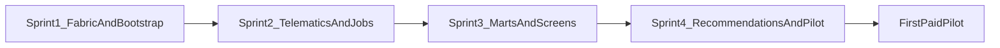

# Fleet Intelligence — 4-Sprint Pilot Roadmap

**Status:** Implementation planning (no application code in this document)  
**Date:** June 2026  
**Companion:** [fleet-intelligence-pivot-plan.md](fleet-intelligence-pivot-plan.md)  
**Scope:** Phase 1 — first sellable paid pilot ($3K–$5K/mo)

---

## Overview

| | |
|---|---|
| **Duration** | 4 sprints × 2 weeks (~8 weeks to pilot-ready) |
| **North star** | First paid pilot customer (15–40 trucks, Samsara/Geotab, 1–2 branches) connects data, runs dispatch from Cornerstone, and sees ROI-trackable recommendations |
| **Pricing target** | $3K–$5K/mo pilot → $5K+ on ROI proof ($36K–$60K ACV) |

### Architectural guardrails (non-negotiable)

- New **fleet bounded context** — do **not** rename `work_orders`, `technicians`, or `companies`
- UI reads **marts** (`utilization_daily`), not raw telematics joins in components
- Separate **`fleet_recommendation_engine`** — do **not** extend [`src/lib/ops-optimization/engine.ts`](../src/lib/ops-optimization/engine.ts) in place
- Reuse existing shells:
  - [`app/(authenticated)/operations/page.tsx`](../app/(authenticated)/operations/page.tsx)
  - [`app/(authenticated)/dispatch/`](../app/(authenticated)/dispatch/)
  - [`app/(authenticated)/reports/operations/page.tsx`](../app/(authenticated)/reports/operations/page.tsx)

---

## Table of contents

1. [Sprint 1 — Integration Fabric + Fleet Schema Bootstrap](#sprint-1--integration-fabric--fleet-schema-bootstrap)
2. [Sprint 2 — Telematics Ingest + Job Webhook + Live Positions](#sprint-2--telematics-ingest--job-webhook--live-positions)
3. [Sprint 3 — Utilization Mart + Three Sellable Screens](#sprint-3--utilization-mart--three-sellable-screens)
4. [Sprint 4 — Recommendations, Outcomes, and Pilot Handoff](#sprint-4--recommendations-outcomes-and-pilot-handoff)
5. [Cross-sprint dependencies and risks](#cross-sprint-dependencies-and-risks)
6. [Explicitly deferred (post-pilot)](#explicitly-deferred-post-pilot)
7. [Phase 1 alignment matrix](#phase-1-alignment-matrix)

---

## Sprint 1 — Integration Fabric + Fleet Schema Bootstrap

**Goal:** Tenant can be configured as fleet, branches/trucks/jobs exist in DB, and CSV bootstrap works — before any telematics or polished dashboards.

### Database changes

| Table / change | Purpose |
|----------------|---------|
| `tenants.product_profile` | Enum/text: `fleet_intelligence` \| `cmms` \| `hybrid` — gates nav and UI |
| `branches` | Child of `companies`: name, depot address, lat/lng, timezone |
| `integration_connections` | tenant_id, provider, status, credentials_ref (vault/env), config jsonb |
| `integration_sync_runs` | connection_id, started_at, finished_at, status, records_processed, error |
| `external_entity_mappings` | connection_id, entity_type, external_id, internal_id |
| `customer_sites` | customer_id (optional), company_id, name, address, lat/lng, optional `property_id` |
| `trucks` | branch_id, unit_number, type, capacity jsonb, status, home_depot lat/lng, telematics_device_id |
| `fleet_operators` | branch_id, name, operator_role, optional user_id / technician_id |
| `fleet_jobs` | branch_id, customer_site_id, status, priority, scheduled_window, **revenue_estimate (NOT NULL)**, required_truck_type, assigned_truck_id, external_source_id, optional `work_order_id` |

**Migration:** Additive style in [`supabase/migrations/`](../supabase/migrations/) (e.g. `20260331100000_fleet_foundation.sql`). RLS scoped by tenant via company/branch joins per [`docs/multi-tenant-architecture.md`](multi-tenant-architecture.md).

**Optional / defer:** `crews.branch_id`, `crews.default_truck_id` — only if crew assignment needed for pilot demo.

### APIs

| Endpoint / module | Purpose |
|-------------------|---------|
| `src/lib/integrations/` (new) | Connection CRUD, sync run logging, external ID resolution |
| `POST /api/integrations/connections` | Create/update connection (admin) |
| `GET /api/integrations/connections` | List connections + last sync status |
| `GET /api/integrations/sync-runs` | Sync history for Integration Control Plane |
| Server actions: branches, trucks, fleet_jobs CRUD | Minimal admin data entry fallback |
| Geocoding on site create | Reuse [`src/lib/geocoding.ts`](../src/lib/geocoding.ts) |

**Auth:** Extend [`src/lib/permissions.ts`](../src/lib/permissions.ts) with `fleet.view`, `fleet.manage`, `integrations.manage`.

### UI changes

| Surface | Change |
|---------|--------|
| **Integration Control Plane (new)** | Route e.g. `/settings/integrations` or `/fleet/integrations` — connection list, last sync, error banner |
| **Branches admin (new)** | CRUD under `/branches` or nested under company settings |
| **Fleet onboarding import** | Extend [`app/(authenticated)/onboarding-wizard/`](../app/(authenticated)/onboarding-wizard/) — CSV steps for branches, trucks, jobs, sites (reuse `ColumnMappingInterface`, `ImportPreviewTable`) |
| **Product profile toggle** | Internal/super-admin only: set `tenants.product_profile = fleet_intelligence` |
| **Nav (minimal)** | Add Integrations + Branches for fleet profile; do **not** hide CMMS nav yet (Sprint 3) |

### Integrations

- **CSV import (P0):** Templates for branches, trucks, fleet_jobs (revenue required), customer_sites
- **Demo seed:** Hydrovac scenario (15–25 trucks, 1–2 branches, 30 days of jobs) — SQL or CSV pack for sales demos
- **No live telematics yet** — manual lat/lng on trucks acceptable for Sprint 1 QA

### Success criteria

- [ ] Fleet tenant created with `product_profile = fleet_intelligence`
- [ ] Demo tenant populated via CSV: ≥15 trucks, ≥2 branches, ≥50 jobs with revenue + geocoded sites
- [ ] Integration Control Plane shows connection records and sync run history (including CSV-triggered runs)
- [ ] No changes to `work_orders` / `technicians` table names or primary dispatch flow
- [ ] RLS verified: tenant A cannot read tenant B fleet data

---

## Sprint 2 — Telematics Ingest + Job Webhook + Live Positions

**Goal:** Real truck GPS flowing in; jobs can arrive via webhook; integration health is trustworthy for a pilot demo.

### Database changes

| Table / change | Purpose |
|----------------|---------|
| `telematics_events` | Append-only: truck_id, ts, lat/lng, speed, odometer, engine_on, idle, source, raw jsonb |
| Index | `(truck_id, ts DESC)` for latest position queries |
| `trucks.last_telematics_at` | Denormalized for fast map queries (updated on ingest) |
| Optional view | `truck_latest_position` — latest event per truck |

**Retention:** 90 days raw events for pilot; aggregate to mart in Sprint 3.

### APIs

| Endpoint / module | Purpose |
|-------------------|---------|
| `POST /api/integrations/webhooks/jobs` | Inbound job upsert (auth via connection secret/header) |
| `POST /api/integrations/webhooks/telematics` | Generic GPS event ingest (non-Samsara fallback) |
| `src/lib/integrations/connectors/samsara/` (new) | OAuth token storage, vehicle list sync, GPS poll or webhook handler |
| `POST /api/integrations/samsara/oauth/callback` | OAuth completion |
| `POST /api/integrations/samsara/sync` | Manual/cron trigger: vehicles + positions |
| Background job | Vercel cron or Supabase scheduled function: poll Samsara every 1–5 min per active connection |

**Mapping:** Samsara vehicle ID → `external_entity_mappings` → `trucks.id`; each sync writes `integration_sync_runs`.

**Validation:** Reject jobs missing `revenue_estimate`, site coords (or geocode address), `required_truck_type`.

### UI changes

| Surface | Change |
|---------|--------|
| **Integration Control Plane** | Samsara Connect button, OAuth status, last GPS sync, record counts, errors |
| **Trucks list** | Last telematics time, online/offline indicator |
| **Fleet jobs list (minimal)** | Inbound webhook jobs with `external_source_id` |
| **Webhook docs panel** | In-app job payload schema + auth header for pilot self-serve |

### Integrations

| Priority | Integration |
|----------|-------------|
| **P0** | **Samsara** — vehicle list + GPS (poll ≥ every 5 min; target ≤5 min lag) |
| **P0** | **Generic job webhook** — JSON schema for `fleet_jobs` upsert |
| **P0** | **CSV job import** — bulk historical jobs (extends Sprint 1 wizard) |
| **Defer** | Geotab, QuickBooks, Fleetio |

**Historical backfill:** One-time Samsara API pull for 7–90 days of GPS → `telematics_events`.

### Success criteria

- [ ] Samsara OAuth connect flow completes for a test org
- [ ] ≥15 trucks mapped and receiving positions with **≤5 min lag** (measured)
- [ ] Job webhook creates/updates `fleet_jobs` with revenue + site coords
- [ ] Integration Control Plane shows green/red per connection; failed syncs alert via [`src/lib/notifications/policy.ts`](../src/lib/notifications/policy.ts) — new event type `integration.sync_failed`
- [ ] `telematics_events` is append-only — no updates/deletes on events

---

## Sprint 3 — Utilization Mart + Three Sellable Screens

**Goal:** Pilot buyer sees fleet KPIs and dispatch board — not CMMS — populated entirely from fleet marts.

### Database changes

| Table / change | Purpose |
|----------------|---------|
| `utilization_daily` | truck_id, branch_id, date, billable_hours, idle_hours, total_hours, miles, revenue, deadhead_miles (heuristic), committed_hours |
| `branch_capacity_snapshots` | branch_id, date, available_truck_hours, committed_hours |
| Mart refresh | `src/lib/fleet/marts/refresh-utilization-daily.ts` or SQL function — nightly + on-demand after sync |

**Mart inputs:** `telematics_events` (idle/engine), `fleet_jobs` (windows, revenue, assignments), [`dispatch-map-utils.ts`](../app/(authenticated)/dispatch/dispatch-map-utils.ts) Haversine for deadhead (**label as heuristic** in UI).

### APIs

| Endpoint / module | Purpose |
|-------------------|---------|
| `src/lib/fleet/queries/` (new) | Command center KPIs, dispatch board data, utilization report |
| `GET /api/fleet/command-center` | Active/idle trucks, jobs today, utilization %, revenue/truck MTD |
| `GET /api/fleet/dispatch-board` | Jobs queue + truck lanes + latest positions |
| `GET /api/fleet/utilization` | Truck × day × branch aggregates |
| `GET /api/fleet/utilization/export` | CSV export — pattern from [`app/api/reports/export/route.ts`](../app/api/reports/export/route.ts) |
| Mart cron | `POST /api/cron/fleet/refresh-marts` (secured) |

### UI changes

| Screen | Base shell | Fleet changes |
|--------|------------|---------------|
| **A. Fleet Command Center** | [`/operations`](../app/(authenticated)/operations/page.tsx) | Fleet KPI cards; hide PM compliance for `fleet_intelligence`; placeholder for recommendations widget |
| **B. Dispatch Intelligence Board** | [`/dispatch`](../app/(authenticated)/dispatch/page.tsx) | Truck lanes; map pins for trucks + jobs; capacity bars from [`DispatchWorkforcePanel.tsx`](../app/(authenticated)/dispatch/components/DispatchWorkforcePanel.tsx); deadhead + ETA; assign job → truck |
| **C. Utilization & Revenue Report** | [`/reports/operations`](../app/(authenticated)/reports/operations/page.tsx) | Fleet report (not maintenance `OperationsReportType`); truck/branch table; week-over-week trend; CSV export |
| **Nav** | [`nav-config.ts`](../app/(authenticated)/nav-config.ts) | Fleet profile: primary = Command Center, Dispatch, Utilization, Integrations; hide/de-emphasize PM, inventory, property hierarchy |
| **Marketing (optional)** | [`app/(marketing)/page.tsx`](../app/(marketing)/page.tsx) | `/fleet` landing variant — defer full rebrand |

**Data rule:** All three screens read **`utilization_daily` + mart queries** only.

### Integrations

- Samsara continuous sync (Sprint 2) feeds mart refresh
- CSV historical jobs fill revenue/truck denominators
- **Defer:** QuickBooks (manual revenue on job sufficient for pilot)

### Success criteria

- [ ] Fleet tenant sees **3 screens** with real data: Command Center, Dispatch Board, Utilization Report
- [ ] Utilization report shows ≥7 days history per truck after backfill
- [ ] Revenue/truck MTD is non-zero when jobs have revenue
- [ ] Dispatch map shows truck + job pins; deadhead labeled "estimated"
- [ ] CMMS modules hidden/de-emphasized for `product_profile = fleet_intelligence`
- [ ] Internal demo: 30-second morning briefing works without spreadsheet

---

## Sprint 4 — Recommendations, Outcomes, and Pilot Handoff

**Goal:** Differentiated decision layer live; accept/dismiss tracked; pilot customer can sign $3K–$5K/mo with 90-day ROI baseline.

### Database changes

| Table / change | Purpose |
|----------------|---------|
| `recommendation_instances` | type, branch_id, entity_refs jsonb, score, rationale, status (pending/accepted/dismissed/expired), expires_at |
| `recommendation_outcomes` | instance_id, action, acted_by, acted_at, estimated_impact_usd, measured_impact_usd (nullable stub), notes |

**V1 types:** `truck_assignment`, `capacity_overload`, `idle_job_match`, `dispatch_deferral` (deferral may be stubbed if time-constrained).

### APIs

| Endpoint / module | Purpose |
|-------------------|---------|
| `src/lib/fleet-recommendation-engine/` (new) | Separate from WO optimizer; mirrors [`src/lib/ops-optimization/types.ts`](../src/lib/ops-optimization/types.ts) proposal shape |
| `GET /api/fleet/recommendations` | Active recommendations for branch/tenant |
| `POST /api/fleet/recommendations/[id]/accept` | Apply action (e.g. assign truck), log outcome |
| `POST /api/fleet/recommendations/[id]/dismiss` | Dismiss with reason, log outcome |
| Cron | Regenerate recommendations every 15–60 min or on mart refresh |

**V1 rule logic:**

- **Truck assignment** — nearest eligible truck by type/capacity + deadhead miles + ETA
- **Capacity overload** — branch/day committed hours > available
- **Idle↔job match** — truck idle > threshold + unassigned job within radius

### UI changes

| Surface | Change |
|---------|--------|
| **Recommendation inbox** | Panel on Command Center + Dispatch (reuse optimization widget pattern) |
| **Accept/dismiss UX** | Confirm assign on accept; audit in [`src/lib/activity-logs.ts`](../src/lib/activity-logs.ts) |
| **Integration Control Plane** | Pilot readiness checklist: telematics, jobs, mart fresh, recommendations active |
| **Pilot onboarding runbook** | [`docs/fleet-pilot-onboarding.md`](fleet-pilot-onboarding.md) — connect Samsara, import jobs, verify 3 screens |
| **Weekly export** | One-click utilization CSV/PDF for owner review |

### Integrations

- **Pilot customer:** Live Samsara + job webhook or CSV daily feed
- **Notifications:** `fleet.recommendation_created`, `integration.sync_failed` via existing policy layers
- **Defer:** QuickBooks, outbound webhook to SoR, Fleetio

### Success criteria (pilot-ready gate)

- [ ] ≥3 recommendation types generating daily on demo tenant
- [ ] Accept truck assignment → `fleet_jobs.assigned_truck_id` updated
- [ ] Accept/dismiss stored in `recommendation_outcomes` with user + timestamp
- [ ] Command Center shows top 3 recommendations with explainable rationale (deadhead, truck type)
- [ ] End-to-end pilot script in **<4 hours:** connect Samsara → import jobs → see screens → act on recommendation
- [ ] **Paid pilot defensible at $3K–$5K/mo:** live telematics, revenue/truck, utilization history, tracked recommendations ([pivot plan Section 15](fleet-intelligence-pivot-plan.md#15-pricing-value-thresholds))

---

## Cross-sprint dependencies and risks

| Risk | Mitigation |
|------|------------|
| Samsara OAuth delays | Generic telematics webhook + CSV truck positions as demo fallback |
| Mart correctness | Single refresh module + integration tests on hydrovac seed data |
| Dispatch refactor scope | Truck lanes as parallel data path — do not rewrite WO dispatch in Sprint 3 |
| CMMS nav confusion | `product_profile` gating in Sprint 3 before external pilot demos |
| Recommendation trust | Rules-first with explicit rationale; no LLM dependency for pilot |

### Sprint dependency chain

| Sprint | Depends on | Unblocks |
|--------|------------|----------|
| 1 | — | CSV demo data, integration fabric, fleet schema |
| 2 | Sprint 1 entities + mappings | Live GPS, job webhook, integration health |
| 3 | Sprint 2 telematics + jobs | Three sellable screens, mart-backed KPIs |
| 4 | Sprint 3 marts + dispatch UI | Recommendations, outcomes, paid pilot |

---

## Explicitly deferred (post-pilot)

- QuickBooks / Fleetio mirrors
- Margin/cost model (Phase 2 PMF per pivot plan)
- Scenario planner, branch comparison executive dashboard
- Geotab / Motive connectors
- Outbound webhook to dispatch system of record
- OR-Tools routing, ML forecasting
- Renaming CMMS entities or adding `truck_id` to `work_orders`

---

## Phase 1 alignment matrix

Cross-reference of this 4-sprint roadmap against [Phase 1 — First sellable pilot](fleet-intelligence-pivot-plan.md#phase-1--first-sellable-pilot-months-09--36k60k-acv) and [First Build Sequence](fleet-intelligence-pivot-plan.md#14-first-build-sequence-foundation-first) in the strategic plan.

### Phase 1 requirements → sprint mapping

| Pivot plan requirement | Sprint | Notes |
|------------------------|--------|-------|
| Integration fabric (`integration_connections`, sync runs, external mappings) | **1** | Foundation-first step 1 |
| `branches` child of `companies` | **1** | Foundation-first step 2 |
| Fleet entities (`trucks`, `fleet_operators`, `fleet_jobs`, `customer_sites`) | **1** | Foundation-first step 3 |
| `telematics_events` + one telematics connector | **2** | Foundation-first step 4; Samsara P0 |
| Job ingest (webhook + CSV); revenue required on `fleet_jobs` | **1** (CSV) + **2** (webhook) | Foundation-first step 5 |
| `utilization_daily` mart | **3** | Foundation-first step 6; all UI reads marts |
| `recommendation_instances` + `recommendation_outcomes` + `fleet_recommendation_engine` | **4** | Foundation-first steps 7; separate from WO optimizer |
| Tenant `product_profile` (`fleet_intelligence`) | **1** (schema) + **3** (nav gating) | Foundation-first step 8 |
| UI: Integration Control Plane → Command Center → Dispatch → Utilization Report | **1** (Control Plane) + **3** (3 screens) + **4** (recommendations) | Foundation-first step 9 |
| Pilot seed + first paid customer ROI tracking | **1** (seed) + **4** (outcomes, runbook) | Foundation-first step 10 |

### Phase 1 screens → sprint mapping

| Screen (pivot plan §8) | Sprint delivered |
|------------------------|------------------|
| Integration Control Plane | Sprint 1 (minimal) → Sprint 2 (Samsara) → Sprint 4 (readiness checklist) |
| Fleet Command Center | Sprint 3 |
| Dispatch Intelligence Board | Sprint 3 |
| Utilization & Revenue Report | Sprint 3 |
| Recommendation inbox | Sprint 4 |

### Phase 1 integrations → sprint mapping

| Integration (pivot plan §10) | Sprint | Priority |
|------------------------------|--------|----------|
| CSV import | **1** | P0 |
| Generic REST webhook (jobs + GPS) | **2** | P0 |
| Samsara (telematics + vehicle list) | **2** | P0 |
| QuickBooks | Deferred | P1 — manual revenue on job sufficient for pilot |

### Phase 1 recommendations → sprint mapping

| Recommendation type (pivot plan §9) | Sprint |
|-------------------------------------|--------|
| Truck assign (type + deadhead + ETA) | **4** |
| Capacity overload alert | **4** |
| Idle truck ↔ matchable job | **4** |
| Accept/dismiss + outcome stub | **4** |
| Dispatch deferral | **4** (stub acceptable) |

### $5K/mo minimum bar (pivot plan §15) → sprint coverage

| $5K requirement | Covered by |
|-----------------|------------|
| 3 operational screens + integration health | Sprints 1–3 |
| Live truck positions ≤5 min lag | Sprint 2 |
| ≥90 days utilization history (target) | Sprint 2 backfill + Sprint 3 mart |
| Fleet jobs with revenue + site + truck type | Sprint 1 schema + Sprint 2 ingest |
| Truck assign, overload, idle-match recommendations | Sprint 4 |
| Accept/dismiss + audit trail | Sprint 4 |

**Gap acknowledged:** Full 90-day utilization history requires Sprint 2 backfill depth; pilot can start with 7–30 days and expand during pilot period.

---

## Related documentation

- [fleet-intelligence-pivot-plan.md](fleet-intelligence-pivot-plan.md) — strategic plan (Phase 1–4, pricing, entity strategy)
- [multi-tenant-architecture.md](multi-tenant-architecture.md)
- [dispatch-command-center.md](dispatch-command-center.md)
- [notification-architecture.md](notification-architecture.md)
