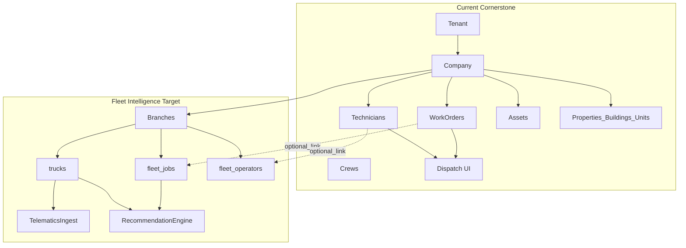
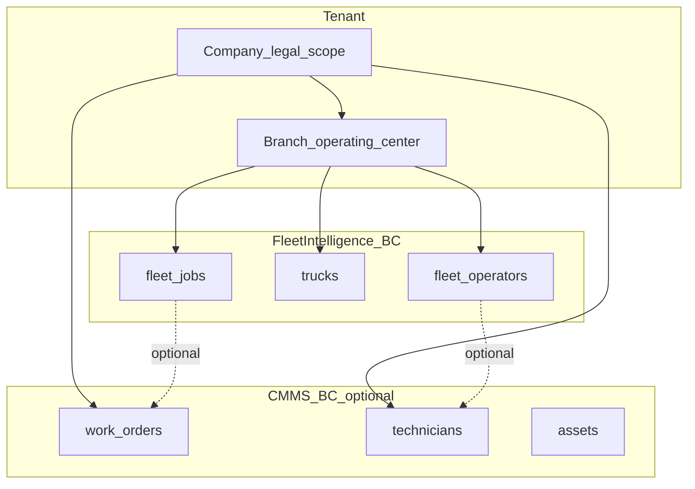
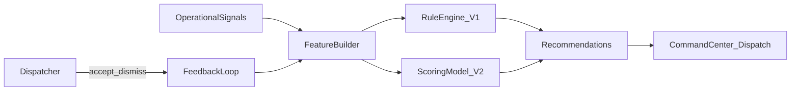
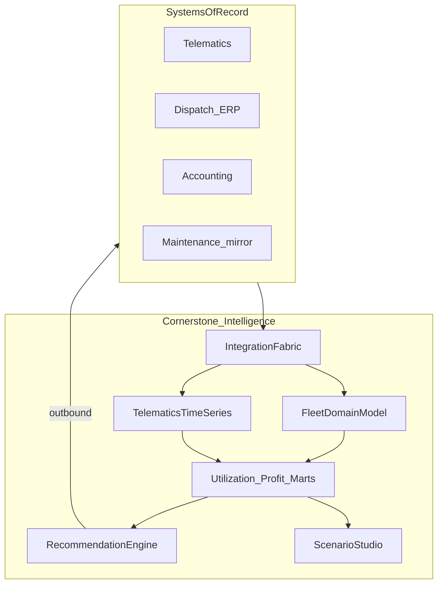

# Fleet Intelligence Pivot — Strategic Planning Document

**Status:** Planning only (no application code, migrations, or renames in this document)  
**Date:** June 2026  
**Audience:** Product, engineering, and go-to-market leadership

---

## Table of contents

1. [Executive Summary](#1-executive-summary)
2. [Current Platform Assessment](#2-current-platform-assessment)
3. [Reusable Infrastructure](#3-reusable-infrastructure)
4. [Entity Mapping Challenge](#4-entity-mapping-challenge)
5. [CMMS Concepts Analysis](#5-cmms-concepts-analysis)
6. [Fleet Intelligence Product Vision](#6-fleet-intelligence-product-vision)
7. [Proposed Data Model](#7-proposed-data-model)
8. [Screen-by-Screen Product Design](#8-screen-by-screen-product-design)
9. [Recommendation Engine Design](#9-recommendation-engine-design)
10. [Integration Strategy](#10-integration-strategy)
11. [Competitive Landscape](#11-competitive-landscape)
12. [What NOT To Build](#12-what-not-to-build)
13. [Reuse Assessment](#13-reuse-assessment)
14. [First Build Sequence (Foundation-First)](#14-first-build-sequence-foundation-first)
15. [Pricing Value Thresholds](#15-pricing-value-thresholds)
16. [Three-Year Vision & Phased Roadmap](#16-three-year-vision--phased-roadmap)

---

## 1. Executive Summary

Cornerstone was built as a **CMMS and operations platform** for fixed-site maintenance: work orders, assets, preventive maintenance, inventory, and technician execution. The codebase has a strong **operations intelligence shell** — multi-tenant SaaS, dispatch board, maps, layered notifications, rule-based optimization, and an AI read layer — but almost no **fleet domain** (no vehicles, telematics ingest, or truck-centric KPIs).

This document evaluates a strategic pivot toward a **dispatch-first fleet intelligence platform** for industrial fleet operators:

- Hydrovac and vacuum truck
- Industrial cleaning and environmental services
- Utility contractors and industrial service fleets

**Target positioning:** The **RELEX of industrial fleet operations** — a **system of decision** that sits on top of systems of record — not ServiceTitan-style field service ERP, not CMMS, not telematics replacement.

**Thesis:** Success requires a **domain and data-plane expansion**: new fleet bounded-context entities (jobs, trucks, operators, branches, telematics events, utilization marts) plus an **integration fabric**, while reusing dispatch UI patterns, auth, notifications, and dashboard shells. CMMS tables remain optional for hybrid tenants; **renaming** work orders, technicians, or companies is rejected (see [Section 4](#4-entity-mapping-challenge)).

**Pilot path:** Three sellable demo screens — Fleet Command Center, Dispatch Intelligence Board, Utilization & Revenue Report — built on **new fleet entities and marts**, reading from existing shells at `/operations`, `/dispatch`, and `/reports/operations`. Populate via CSV + one telematics connector before polish features.

**Honest baseline:** Cornerstone **cannot** sell fleet intelligence at meaningful ACV today. Shell reuse accelerates UI delivery; it does not substitute for telematics, fleet data model, or ROI proof.

---

## 2. Current Platform Assessment

### 2.1 Architecture (observed)

| Layer | Implementation |
|-------|----------------|
| Framework | Next.js 16 App Router |
| Database | Supabase Postgres |
| Server logic | Server Actions + selective REST under `app/api/` |
| Tenancy | Tenant → Company → operational data ([`docs/multi-tenant-architecture.md`](multi-tenant-architecture.md), [`src/lib/auth-context.ts`](../src/lib/auth-context.ts)) |
| Primary hub | `/operations` ([`app/(authenticated)/operations/page.tsx`](../app/(authenticated)/operations/page.tsx)); `/dashboard` redirects here |

### 2.2 Major modules (observed)

| Module | Route | Role today |
|--------|-------|------------|
| Operations Center | `/operations` | KPI dashboard, PM compliance, optimization widget |
| Dispatch | `/dispatch` | Day board, map, capacity bars, rebalance ([`docs/dispatch-command-center.md`](dispatch-command-center.md)) |
| Work Orders | `/work-orders` | Job lifecycle, SLA, parts, labor |
| Requests / Portal | `/requests`, `/portal` | Intake + technician field execution |
| Assets + Intelligence | `/assets`, `/assets/intelligence` | Fixed equipment health — **not vehicles** |
| PM | `/preventive-maintenance` | Schedule-based maintenance programs |
| Location hierarchy | `/properties`, `/buildings`, `/units` | Facility sites |
| People | `/technicians`, `/crews` | Workforce roster — **not fleet drivers** |
| Supply chain | `/inventory`, `/purchase-orders`, `/vendors` | Parts/procurement (CMMS scope) |
| Reports | `/reports`, `/reports/operations` | Metabase embed + native ops intelligence |
| Settings / Platform | `/settings/*`, `/platform` | Org admin, super-admin |

Navigation is defined in [`app/(authenticated)/nav-config.ts`](../app/(authenticated)/nav-config.ts). Marketing positioning remains CMMS-oriented ([`app/(marketing)/page.tsx`](../app/(marketing)/page.tsx)).

### 2.3 Strengths (observed — reusable)

- **Dispatch UX** with utilization/capacity concepts — green/amber/red bars in [`DispatchWorkforcePanel.tsx`](../app/(authenticated)/dispatch/components/DispatchWorkforcePanel.tsx)
- **Map stack:** Leaflet dispatch map, Mapbox geocoding ([`DispatchMapPanel.tsx`](../app/(authenticated)/dispatch/components/DispatchMapPanel.tsx), [`src/lib/geocoding.ts`](../src/lib/geocoding.ts))
- **Technician GPS** via portal ([`technician_locations`](../supabase/migrations/20260314050000_technician_portal_identity_tracking.sql), [`app/api/portal/location/route.ts`](../app/api/portal/location/route.ts)) — *not* a substitute for truck telematics
- **Rule-based optimization** ([`src/lib/ops-optimization/engine.ts`](../src/lib/ops-optimization/engine.ts)) + suggestions engine
- **Layered notifications** ([`src/lib/notifications/policy.ts`](../src/lib/notifications/policy.ts), [`docs/notification-architecture.md`](notification-architecture.md))
- **Activity/audit logging** ([`src/lib/activity-logs.ts`](../src/lib/activity-logs.ts))
- **Onboarding CSV import** ([`app/(authenticated)/onboarding-wizard/`](../app/(authenticated)/onboarding-wizard/))
- **AI ops assistant** (read-mostly) + confirmed WO actions ([`docs/cornerstone-ai-v1.md`](cornerstone-ai-v1.md))

### 2.4 Limitations (observed — fleet gap)

- **Zero fleet domain:** No `fleet`, `vehicle`, VIN, odometer, or telematics tables (repo-wide grep). `truck` appears only as inventory `stock_locations.location_type` in [`src/types/inventory.ts`](../src/types/inventory.ts)
- **Dispatch optimizes people/work orders**, not trucks, deadhead, or margin
- **Routing is heuristic** — Haversine + fixed MPH in [`dispatch-map-utils.ts`](../app/(authenticated)/dispatch/dispatch-map-utils.ts), not road-network optimization
- **No integration spine** — no webhooks, connector registry, or telematics ingest (no matches in `app/api/integrations/`)
- **Reports are maintenance-centric** — `OperationsReportType` in [`src/lib/dashboard/operations-intelligence.ts`](../src/lib/dashboard/operations-intelligence.ts): cost by asset/building, WO by technician/property, asset failure rate
- **CMMS surface dominates** nav and product story

### 2.5 Architecture snapshot

---

## 3. Reusable Infrastructure

| Foundation | Location | Fleet reuse |
|------------|----------|-------------|
| Auth + session | [`middleware.ts`](../middleware.ts), Supabase SSR | **High** — unchanged |
| Multi-tenancy | `tenants`, `companies`, `tenant_memberships` | **High** — keep `companies`; add `branches` as child |
| Permissions | [`src/lib/permissions.ts`](../src/lib/permissions.ts) | **High** — add fleet permissions |
| Shell + nav | [`app/(authenticated)/components/`](../app/(authenticated)/components/), [`nav-config.ts`](../app/(authenticated)/nav-config.ts) | **Medium** — re-skin for fleet product profile |
| UI primitives | [`src/components/ui/`](../src/components/ui/) | **High** |
| Dispatch board + map | [`app/(authenticated)/dispatch/`](../app/(authenticated)/dispatch/) | **Medium–High** — swap entity layers |
| Operations dashboard | [`src/lib/dashboard/operations.ts`](../src/lib/dashboard/operations.ts) | **Medium** — new KPI queries from fleet marts |
| Notifications | [`src/lib/notifications/`](../src/lib/notifications/) | **High** — new fleet event types |
| Activity logs | `activity_logs`, `audit_logs` | **High** |
| CSV import UX | Onboarding wizard | **High** — fleet roster/jobs import |
| Metabase embed | [`src/lib/metabase.ts`](../src/lib/metabase.ts) | **Medium** — external BI supplement only |
| AI retrieval + quota | [`src/lib/cornerstone-ai/`](../src/lib/cornerstone-ai/), [`src/lib/ai/metering.ts`](../src/lib/ai/metering.ts) | **Medium** — extend retrieval to fleet entities |
| API pattern | [`app/api/`](../app/api/) | **Medium** — add ingest webhooks |

**Low reuse / high risk:** PM module, HVAC asset intelligence, inventory/PO workflows, deep property/building/unit hierarchy, portal technician app as primary fleet UX.

---

## 4. Entity Mapping Challenge

> **Assumption review:** Mapping Work Orders → Jobs, Technicians → Drivers, and Companies → Branches via **rename** is unsafe. Long-term architecture uses **new fleet entities + optional links** and a **tenant product profile**.

### 4.1 Summary recommendation

| Option | Verdict |
|--------|---------|
| 1. Rename existing entities | **Reject** — wrong semantics, massive FK/code surface, blocks hybrid tenants |
| 2. Create new fleet entities only | **Partial** — correct fleet domain; must bridge dispatch plumbing |
| 3. **Both models (bounded contexts)** | **Recommended** — fleet BC + optional CMMS BC |

**Principle:** Fleet intelligence models **dispatch decisions**. Legacy CMMS models **maintenance execution**. Link them; do not merge by rename.

### 4.2 Work orders → jobs

**Observed:** `work_orders` is a company-scoped execution record with asset/location FKs, `assigned_technician_id`, SLA, parts/labor, PM origin, portal APIs, `work_order.*` notifications, and optimization-engine queries ([`src/lib/ops-optimization/engine.ts`](../src/lib/ops-optimization/engine.ts)).

**Fleet job needs:** Commercial dispatch commitment — revenue, truck type/capacity, billable window, external SoR ID, truck-first assignment — often without CMMS execution detail.

| Breakdown | Detail |
|-----------|--------|
| Semantic mismatch | WO = maintenance task; job = commercial dispatch unit |
| PM coupling | PM auto-generates WOs from assets — not fleet dispatch |
| CMMS fields | `asset_id`, checklist, parts pollute fleet UX if renamed |
| Integration | External systems use Order/Job/Dispatch — should not require CMMS schema |
| Recommendations | Margin, deadhead, truck type are foreign to WO model |

**Recommendation (proposed):** Create **`fleet_jobs`** scoped to `branch_id`. Optional `work_order_id` for hybrid execution. **Do not rename** `work_orders`.

### 4.3 Technicians → drivers/operators

**Observed:** `technicians` = company roster, portal `user_id`, browser GPS (`technician_locations`), crew membership, WO labor. `tenant_memberships.role = technician` is **auth**, not job title ([`src/lib/permissions.ts`](../src/lib/permissions.ts)).

**Fleet operator needs:** Certifications, branch home, optional user link; **telemetry on truck**; crew-based dispatch (driver + operator).

| Breakdown | Detail |
|-----------|--------|
| Truck vs person | Fleet optimizes vehicle capacity; dispatch panel optimizes human hours ([`DispatchWorkforcePanel.tsx`](../app/(authenticated)/dispatch/components/DispatchWorkforcePanel.tsx)) |
| Auth coupling | Portal identity assumes `technicians` table |
| Role confusion | Dispatchers are not drivers; drivers may not use Cornerstone |
| Location source | Browser GPS ≠ telematics vehicle track |
| Assignment | WO uses single `assigned_technician_id`; fleet uses truck + crew |

**Recommendation (proposed):** Create **`fleet_operators`** and **`trucks`**. Optional `technician_id` / `user_id` links. **Do not rename** `technicians`.

### 4.4 Companies → branches

**Observed:** `company_id` is the universal scope key across properties, assets, work orders, technicians, customers, inventory, POs, notifications, and activity logs. Tenants may have **multiple companies** ([`docs/multi-tenant-architecture.md`](multi-tenant-architecture.md)).

**Fleet branch needs:** Geographic yard — depot coords, local truck pool — **many branches under one legal company**.

| Breakdown | Detail |
|-----------|--------|
| Hierarchy inversion | Branch ⊂ Company; rename collapses legal vs geographic scope |
| Multi-company tenants | FM-style tenants need company as legal boundary |
| FK surface | Dozens of tables use `company_id` — rename is illusory without full migration |
| Crew scope | Crews are tenant-scoped today ([`20250308100000_tenant_crews_unit_flexibility.sql`](../supabase/migrations/20250308100000_tenant_crews_unit_flexibility.sql)); branches need explicit home yard |

**Recommendation (proposed):** Add **`branches`** as child of **`companies`**. Fleet entities use `branch_id`. **Do not rename** `companies`.

### 4.5 Dual bounded contexts (target)

**Tenant product profile (proposed):** `fleet_intelligence` | `cmms` | `hybrid`. UI labels via config/i18n — not table renames.

---

## 5. CMMS Concepts Analysis

| CMMS concept | Fleet equivalent | Long-term action |
|--------------|------------------|------------------|
| Work order | `fleet_jobs` | New entity; optional `work_order_id` — do not rename table |
| Technician | `fleet_operators` | New entity; optional `technician_id` / `user_id` — do not rename |
| Crew | Crew (extend) | Add `branch_id`, `default_truck_id`; keep tenant-scoped `crews` |
| Company | Company + `branches` | Add branches as child — do not rename company |
| Property/building/unit | Customer site | New/simplified site entity; optional `property_id` for hybrid |
| Asset | `trucks` vs `assets` | Separate entities; optional external ref to Fleetio/asset |
| PM schedules | Fleetio mirror only | Not native CMMS PM for fleet tenants |
| Inventory / PO | Out of scope | Hide for fleet product profile |
| Work requests / portal | Optional intake → `fleet_jobs` | Portal = CMMS execution in hybrid only |
| SLA / checklist / parts on WO | CMMS only | Stays on linked `work_orders`; not on `fleet_jobs` |

**Confusion risks:** Marketing as CMMS; nav labels "Work Orders", "Preventive Maintenance", "Asset Intelligence"; Metabase reports titled maintenance cost by building.

---

## 6. Fleet Intelligence Product Vision

**One-liner:** Decision layer for industrial fleet operators — aggregate jobs, trucks, telematics, and financial signals to recommend **who to send, when, and with what capacity** to maximize **utilization and revenue per truck**.

**RELEX-inspired pillars (fleet-applied):**

1. **Unified operational picture** — jobs, trucks, operators, sites on one map/timeline
2. **Utilization & capacity intelligence** — hours, miles, deadhead, idle, branch-level capacity
3. **Recommendations** — assign truck, rebalance day, defer/accept job based on margin
4. **Scenario planning** — "what if we lose a truck" / "what if we add demand tomorrow"
5. **Profitability lens** — revenue per truck, cost per mile (from QB or manual rates) — not full accounting

**Personas:** Dispatch manager, branch manager, fleet owner/ops director — **not** field tech primary, **not** accountant.

**Target industries:** Hydrovac, vacuum truck, industrial cleaning, environmental services, utility contractors, industrial service fleets.

**Explicitly NOT:** CMMS, ERP, accounting, payroll, ticketing, ServiceTitan-style field service ERP.

---

## 7. Proposed Data Model

> **Proposed** conceptual schema — no migrations in this planning phase.

| Entity | Key fields (summary) | Strategy |
|--------|----------------------|----------|
| `fleet_jobs` | company_id, branch_id, customer_site_id, status, priority, scheduled_window, revenue_estimate, required_truck_type, assigned_truck_id, assigned_crew_id, external_source_id, optional `work_order_id` | **Net-new**; optional CMMS link |
| `trucks` | branch_id, unit_number, type, capacity specs, telematics_device_id, status, home_depot lat/lng, optional `external_asset_id` | **Net-new** — not `assets` |
| `fleet_operators` | branch_id, optional user_id, optional technician_id, certifications, hourly_cost, operator_role | **Net-new** |
| `branches` | company_id, name, depot address, lat/lng, timezone | **Net-new** child of `companies` |
| Crew (extended) | existing `crews` + branch_id, default_truck_id | Extend existing |
| `customer_sites` | customer_id, name, address, lat/lng; optional `property_id` | New/simplified |
| `telematics_events` | truck_id, ts, lat/lng, speed, odometer, idle/engine flags, source | **Net-new** append-only; not `technician_locations` |
| `integration_connections` | tenant_id, provider, credentials_ref, status | Integration fabric |
| `integration_sync_runs` | connection_id, started_at, status, error | Integration fabric |
| `external_entity_mappings` | connection_id, entity_type, external_id, internal_id | Integration fabric |
| `recommendation_instances` | type, entity_refs, score, rationale, status | Fleet recommendation engine |
| `recommendation_outcomes` | instance_id, action, estimated_impact_usd, measured_impact_usd | Closed-loop ROI |
| `utilization_daily` | truck_id, branch_id, date, billable_hrs, idle_hrs, revenue, deadhead_mi | Derived mart |
| `capacity_snapshots` | branch_id, date, available_truck_hours, committed_hours | Derived mart |

Include **read-only mirror tables** for QuickBooks revenue, Fleetio maintenance records — system of record stays external.

---

## 8. Screen-by-Screen Product Design

### First three sellable demo screens

#### Screen A: Fleet Command Center

| | |
|---|---|
| **Purpose** | Morning briefing — fleet KPIs and top recommendations |
| **Persona** | Branch / ops manager |
| **Data required** | Trucks active/idle, jobs today, utilization %, revenue/truck MTD, top 3 recommendations |
| **Business value** | "See bottlenecks and profitability signals in 30 seconds" |
| **Reuse (observed)** | [`app/(authenticated)/operations/page.tsx`](../app/(authenticated)/operations/page.tsx) layout, `OperationOptimizationWidget`, metric cards |
| **Build note (proposed)** | Read **`utilization_daily` mart** only — not PM compliance sections |

#### Screen B: Dispatch Intelligence Board

| | |
|---|---|
| **Purpose** | Assign jobs to trucks with map + capacity |
| **Persona** | Dispatcher |
| **Data required** | Job queue, truck lanes, map pins (trucks + jobs), deadhead estimate, capacity bars |
| **Business value** | "Make better assignment decisions faster" |
| **Reuse (observed)** | [`app/(authenticated)/dispatch/`](../app/(authenticated)/dispatch/) board, map, rebalance modal, drag-drop patterns |
| **Build note (proposed)** | Assignment targets **`fleet_jobs` + trucks** — not `updateWorkOrderAssignment` alone ([`app/(authenticated)/work-orders/actions.ts`](../app/(authenticated)/work-orders/actions.ts)) |

#### Screen C: Truck Utilization & Revenue Report

| | |
|---|---|
| **Purpose** | Weekly review — which trucks underperform |
| **Persona** | Owner / fleet director |
| **Data required** | Utilization by truck, revenue/truck, idle time, deadhead miles, week-over-week trend |
| **Business value** | "Identify trucks to redeploy or retire" |
| **Reuse (observed)** | [`app/(authenticated)/reports/operations/page.tsx`](../app/(authenticated)/reports/operations/page.tsx) pattern, [`app/api/reports/export/route.ts`](../app/api/reports/export/route.ts) |

#### Phase 1 additional screen (proposed)

**Integration Control Plane (minimal)** — connection status, last sync, errors. Required for RELEX positioning and $5k+ credibility; not optional polish.

---

## 9. Recommendation Engine Design

### Current state (observed)

Rule-based proposals in [`src/lib/ops-optimization/engine.ts`](../src/lib/ops-optimization/engine.ts): unassigned/overdue WOs, overloaded **technicians**, asset failure patterns. Exposed via [`app/api/ops/optimization-proposals/route.ts`](../app/api/ops/optimization-proposals/route.ts). Output shape: [`src/lib/ops-optimization/types.ts`](../src/lib/ops-optimization/types.ts).

**Gap:** Scores **technician workload**, not truck margin or deadhead.

### Target architecture (proposed)

**V1 recommendation types (proposed):**

- Truck assignment — eligible type/capacity, deadhead miles + ETA, explainable rationale
- Capacity overload — branch/day over committed hours
- Idle truck ↔ nearby job match
- Dispatch deferral — low-margin job + constrained capacity

**Inputs:** Job site coords, truck home depot, live telematics position, scheduled hours, truck type matrix, revenue estimate, optional cost estimate (Phase 2+).

**Outputs:** Same UX contract as `OptimizationProposal` — title, rationale, impact, proposed action, affected records — stored in **`recommendation_instances`** + **`recommendation_outcomes`**.

**V2 (proposed):** Learn from accept/dismiss; optional LLM narrative via Cornerstone AI ([`docs/cornerstone-ai-v1.md`](cornerstone-ai-v1.md)) — **rules first** for trust.

**Critical (proposed):** Separate **`fleet_recommendation_engine`** module — do not extend WO optimizer in place.

---

## 10. Integration Strategy

| Integration | Role | Priority | Approach |
|-------------|------|----------|----------|
| CSV import | Pilot bootstrap | **P0** | Extend onboarding wizard pattern |
| Generic REST webhook | Jobs + GPS events | **P0** | New `app/api/integrations/*` — **no webhooks exist today** |
| Samsara | Telematics + vehicle list | **P0** (Phase 1) | Via connector framework — OAuth + poll/webhook |
| Geotab | Telematics | **P1** | Similar adapter |
| Motive | Telematics | **P2** | After Samsara/Geotab |
| Fleetio | Maintenance mirror | **P2** | Read-only — do not become CMMS |
| QuickBooks | Revenue / cost | **P1–P2** | Read-only for profitability KPIs — not full accounting |

**Principle:** Inbound-first mirrors for pilot; Cornerstone does not become system of record for maintenance or books. Phase 3+ adds **outbound webhook** for accepted recommendations.

---

## 11. Competitive Landscape

| Competitor | What they are | Cornerstone differentiation |
|------------|---------------|----------------------------|
| **ServiceTitan** | Field service ERP (CRM, dispatch, invoicing) | **No ERP** — decision intelligence only; faster time-to-value when buyer already has ops/finance stack |
| **BuildOps** | Commercial contractor ops + accounting | Avoid accounting; focus **industrial fleet** not construction subs |
| **Fleetio** | Fleet maintenance system of record | **Integrate, don't compete** — sit above with cross-system recommendations |
| **Samsara** | Telematics + compliance + basic dispatch | **Intelligence layer** — multi-source aggregation, scenario planning, profitability on top of their data |

**Whitespace:** RELEX-style **planning + recommendations** for operators running dispatch in spreadsheets + fragmented telematics (hydrovac, vacuum, industrial cleaning).

---

## 12. What NOT To Build

### Avoid ERP drift (pre-PMF and beyond positioning)

Invoicing, payroll, full CRM, marketing automation, customer self-service portals as **primary** product.

### Avoid CMMS drift

Deep PM programs, asset hierarchy hero features, inventory/PO as lead story, building/unit hierarchy for fleet tenants, HVAC asset intelligence as lead narrative.

### Defer post-PMF

Native mobile field app (portal exists but is CMMS execution — not fleet-first), full OR-Tools route optimization, ML demand forecasting, contracts/invoices modules (stubbed under `/dashboard/*` today).

### Defer as foundation (easy but wrong)

- UI-only rename Work Orders → Jobs
- Adding `truck_id` to `work_orders` as primary model
- Technician browser GPS as fleet tracking
- Repurposing PM/asset dashboards without fleet marts
- Metabase-only analytics without internal marts
- LLM chat before structured fleet retrieval exists

---

## 13. Reuse Assessment

| Estimate | Detail |
|----------|--------|
| **~45–55% reusable** | Platform shell, auth, tenancy, permissions, dispatch UI shell, maps, notifications, activity logs, CSV import, basic AI, ops dashboard layout |
| **Highest-value modules** | Dispatch ([`/dispatch`](../app/(authenticated)/dispatch/)), auth/tenancy ([`auth-context.ts`](../src/lib/auth-context.ts)), optimization pattern ([`ops-optimization`](../src/lib/ops-optimization/)), notifications ([`policy.ts`](../src/lib/notifications/policy.ts)), geocoding/map |
| **Highest-risk redesign** | No fleet domain, maintenance-centric reports, nav/marketing positioning, missing integration layer, conflating assets/inventory with fleet, technician portal vs dispatcher intelligence |

Forcing fleet intelligence through `work_orders` / `technicians` / `companies` rename is the **highest long-term architectural risk**.

---

## 14. First Build Sequence (Foundation-First)

Optimize for **$25K–$100K+ ACV** destination — not easiest MVP.

| Step | Build | Type |
|------|-------|------|
| 1 | **Integration fabric** — connections, sync runs, external entity mappings | Proposed |
| 2 | **`branches`** — child of `companies` | Proposed |
| 3 | **Fleet entities** — `trucks`, `fleet_operators`, `fleet_jobs`, `customer_sites` | Proposed |
| 4 | **`telematics_events`** ingest + one telematics connector | Proposed |
| 5 | **Job ingest** — webhook + CSV; **revenue required** on `fleet_jobs` | Proposed |
| 6 | **`utilization_daily` mart** | Proposed |
| 7 | **`recommendation_instances` + `recommendation_outcomes` + `fleet_recommendation_engine`** | Proposed |
| 8 | **Tenant product profile** — `fleet_intelligence` mode | Proposed |
| 9 | **UI (reads marts only)** — Integration Control Plane → Command Center → Dispatch → Utilization Report | Proposed |
| 10 | **Pilot seed + first paid customer** with ROI tracking | Proposed |

### Smallest correct foundation (must exist before premium UI)

| # | Component | Why skipping blocks $25K–$100K ACV |
|---|-----------|-------------------------------------|
| 1 | Integration fabric | RELEX = aggregate SoR; one-off scripts don't scale |
| 2 | Fleet BC entities (not rename) | Clean job/truck/margin domain |
| 3 | `telematics_events` append-only, truck-keyed | Utilization, idle, forecast, deadhead |
| 4 | `fleet_jobs` with revenue + site + truck_type | All $/truck and margin math depends on grain |
| 5 | `utilization_daily` mart | All screens read marts — avoids Phase 2 rewrite |
| 6 | Recommendation instances + outcomes | Closed-loop ROI moat |
| 7 | `fleet_recommendation_engine` ≠ WO optimizer | Truck/margin scoring ≠ technician workload |
| 8 | Tenant `product_profile` | Fleet vs CMMS isolation |

---

## 15. Pricing Value Thresholds

> **Observed:** Cornerstone **cannot** justify fleet pricing today — no fleet data model, telematics, or fleet KPIs.

### Anchor math

| Monthly | Annual | Buyer equivalent |
|---------|--------|------------------|
| **$5,000** | $60k | ~0.7 FTE dispatch analyst OR ~5% utilization on 15–25 trucks |
| **$10,000** | $120k | ~1.2 FTE analyst + integrator OR multi-branch margin gains |

**Competitive floor:** Telematics alone ~$30–50/vehicle/month. A 30-truck fleet may spend **$1k–1.5k/mo** on GPS. Cornerstone at $5k must be **incremental on top of telematics** — not a map clone.

### $5,000/month — dispatch decision layer (one region)

**Buyer:** ~15–40 trucks, 1–2 branches, telematics in place, dispatch in spreadsheets.

| Dimension | Minimum required |
|-----------|------------------|
| **Screens** | Fleet Command Center; Dispatch Intelligence Board; Truck Utilization Report; Integration health |
| **Data** | Truck positions ≤5 min lag; ≥90 days utilization; fleet jobs with revenue + site + truck type; branch depots; billable vs idle hours/day |
| **Integrations** | P0: one telematics; P0: job ingest; P1: QBO or required revenue on job |
| **Recommendations** | Truck assign (type + deadhead); capacity overload; idle↔job match; accept/dismiss + audit |

**Verdict:** Achievable for ~20–30 trucks if automation is real and recommendations save ~1–2 billable hours/truck/week.

### $10,000/month — multi-branch profitability & planning

**Buyer:** ~40–120+ trucks, 3+ yards, leadership team.

| Dimension | Minimum required (includes $5k tier) |
|-----------|-----------------------------------|
| **Screens** | + Branch Comparison; Profitability Explorer; Scenario Planner v1; Recommendation outcomes; Customer/site intelligence |
| **Data** | + 12mo history; cost model; job margin; idle/engine hours; integration lineage |
| **Integrations** | + QBO revenue+cost; Fleetio read; outbound webhook; second telematics optional |
| **Recommendations** | + Margin-opt assign; cross-branch rebalance; scenario tradeoffs; downtime risk; 7-day forecast; weekly exec brief; measured ROI |

**Verdict:** Justifiable when replacing analytical labor across branches **after** 6–12 months proven outcomes at pilot branch.

### Tier comparison

| | **$5k/mo** | **$10k/mo** |
|---|-----------|------------|
| **Promise** | Better dispatch daily | Better profitability weekly |
| **Beat** | Excel + Samsara dashboard | Analyst + fragmented BI |
| **Lose to** | "Good enough" dispatcher + Samsara | ServiceTitan if buyer wants all-in-one |

---

## 16. Three-Year Vision & Phased Roadmap

Work backwards from **$25K–$100K+ ACV**. Phase 1 builds **smallest correct foundation**, not easiest MVP.

### Year 3 ideal (Phase 4)

Cornerstone is the **RELEX of industrial fleets**: aggregates telematics, dispatch/ERP, accounting, maintenance mirrors; recommends and simulates on **utilization, margin, fleet profitability**; never becomes ERP, CMMS, or telematics SoR.

### Phase 4 — Industry-leading platform (Year 3) | $25K–$100K+ ACV

| Dimension | Definition |
|-----------|------------|
| **Buyer** | CEO/COO/VP Ops, 80–300+ trucks, PE roll-ups, 5–15 branches |
| **Pricing** | $25K–$100K+ ACV; enterprise SLAs, custom connectors |
| **Screens** | Command Center (P&L); Dispatch Intelligence; Executive Portfolio; Profitability Explorer; Scenario Studio; Recommendation Command + ROI; Integration Control Plane; Customer/Site Strategy; board export |
| **Entities** | Phase 3 + scenarios, demand_forecasts, cost_models, connector_catalog, orchestration_actions |
| **Integrations** | Multi-telematics; ERP selective write-back; QBO; Fleetio mirror; marketplace; SSO; warehouse export |
| **Recommendations** | Margin-opt; cross-branch; demand-capacity; downtime risk; defer/prioritize; closed-loop learning; $ left on table brief |
| **Reporting** | Real-time marts; 12–36mo trends; margin by truck/customer/job type/branch; forecast vs actual; ROI dashboard |
| **Differentiation** | Only profit + capacity + multi-source decision layer |

### Phase 3 — Multi-branch optimization (Year 2) | $120K–$300K ACV

| Dimension | Definition |
|-----------|------------|
| **Buyer** | Director of Ops, 3–8 branches, 40–120 trucks |
| **Pricing** | $10K–$25K/mo |
| **Screens** | Phase 2 + Branch Comparison; Scenario Planner v1; Profitability Explorer; Recommendation Outcomes |
| **Entities** | + job_margin_snapshots, branch_capacity_snapshots, truck_cost_profiles, customer_contracts, scenario_definitions |
| **Integrations** | 2+ telematics; QBO; Fleetio; outbound webhook |
| **Recommendations** | Margin-weighted assign; cross-branch rebalance; scenario tradeoffs; 7-day capacity forecast |
| **Reporting** | Branch rollups; margin; weekly exec email; board pack |
| **Differentiation** | Multi-branch profit planning without ERP replatform |

### Phase 2 — Product-market fit (Year 1–18 mo) | $60K–$120K ACV

| Dimension | Definition |
|-----------|------------|
| **Buyer** | Owner-operator / Ops Manager, 25–60 trucks, 1–3 branches; 90-day ROI |
| **Pricing** | $5K–$10K/mo |
| **Screens** | Phase 1 + Branch Comparison (basic); Profitability; Recommendation history |
| **Entities** | + truck_cost_profiles, job_cost_estimates, customer_accounts |
| **Integrations** | QBO read; Fleetio read (opt); idle/engine hours |
| **Recommendations** | Margin-aware scoring; underperforming truck alerts |
| **Reporting** | 12mo history; revenue & margin per truck; trends; export |
| **Differentiation** | $/truck + margin with measured outcomes |

### Phase 1 — First sellable pilot (Months 0–9) | $36K–$60K ACV

| Dimension | Definition |
|-----------|------------|
| **Buyer** | Regional dispatch manager, 15–40 trucks, 1–2 branches, Samsara/Geotab |
| **Pricing** | $3K–$5K/mo pilot → $5K+ on ROI proof |
| **Screens** | Integration Control Plane; Fleet Command Center; Dispatch Intelligence Board; Utilization & Revenue Report; Recommendation inbox |
| **Entities** | branches, trucks, fleet_operators, fleet_jobs, customer_sites, integration_*, telematics_events, recommendation_*, utilization_daily |
| **Integrations** | P0: one telematics via connector framework; job webhook+CSV; required revenue on every fleet_job |
| **Recommendations** | Truck assign; capacity overload; idle↔job; mandatory accept/dismiss + outcome stub |
| **Reporting** | Utilization by truck/branch; revenue/truck; deadhead (labeled heuristic); integration uptime |
| **Differentiation** | Decision layer on telematics with outcome tracking from day 1 |

### Phase progression summary

| Phase | Timeline | ACV range | North star |
|-------|----------|-----------|------------|
| **1 — Pilot** | Mo 0–9 | $36K–$60K | Prove decision loop on telematics + jobs |
| **2 — PMF** | Mo 9–18 | $60K–$120K | Prove margin + ROI renewals |
| **3 — Multi-branch** | Year 2 | $120K–$300K | Prove planning across branches |
| **4 — Industry leader** | Year 3 | $25K–$100K+ | Prove platform + multi-source orchestration |

---

## Appendix: Observed vs proposed legend

| Label | Meaning |
|-------|---------|
| **Observed** | Exists in Cornerstone codebase or database today |
| **Proposed** | Recommended for fleet intelligence pivot — not yet built |

---

## Related documentation

- [`docs/multi-tenant-architecture.md`](multi-tenant-architecture.md)
- [`docs/dispatch-command-center.md`](dispatch-command-center.md)
- [`docs/notification-architecture.md`](notification-architecture.md)
- [`docs/permissions-model.md`](permissions-model.md)
- [`docs/cornerstone-ai-v1.md`](cornerstone-ai-v1.md)
