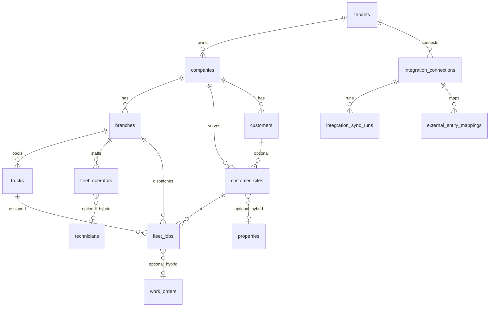
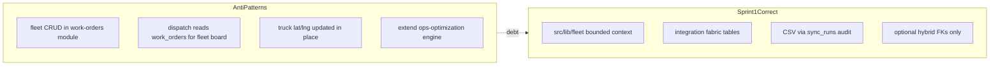

# Sprint 1 — Fleet Foundation Specification

**Status:** Planning / specification (no migrations or application code in this document)  
**Duration:** 2 weeks  
**Date:** June 2026

**Companion documents:**

- [fleet-intelligence-pivot-plan.md](fleet-intelligence-pivot-plan.md) — strategic context, entity mapping (Section 4)
- [fleet-intelligence-implementation-roadmap.md](fleet-intelligence-implementation-roadmap.md) — 4-sprint pilot roadmap

---

## Sprint goal

Establish the **smallest correct foundation** for Fleet Intelligence before telematics, fleet dashboards, or recommendations:

1. Tenant can be configured with `product_profile = fleet_intelligence`
2. Fleet bounded-context entities exist in Postgres (branches, trucks, jobs, operators, sites)
3. Integration fabric tables support connection tracking and external ID mapping
4. CSV bootstrap populates a demo tenant (hydrovac scenario)
5. **Integration Control Plane** shows connection status and sync history

**Explicitly out of scope for Sprint 1:** live telematics, Samsara OAuth, job webhooks, utilization marts, Fleet Command Center KPIs, dispatch truck lanes, recommendation engine, CMMS nav hiding.

### Architectural guardrails

| Rule | Rationale |
|------|-----------|
| Do **not** rename `work_orders`, `technicians`, or `companies` | [Pivot plan Section 4](fleet-intelligence-pivot-plan.md#4-entity-mapping-challenge) |
| New fleet tables in a separate bounded context | Optional hybrid links only (`work_order_id`, `technician_id`, `property_id`) |
| Do **not** extend [`src/lib/ops-optimization/engine.ts`](../src/lib/ops-optimization/engine.ts) | Fleet recommendation engine is Sprint 4 |
| Do **not** store live GPS on `trucks` columns | Sprint 2 uses append-only `telematics_events` |

**Legend:** **Observed** = exists in codebase today. **Proposed** = Sprint 1 deliverable.

---

## Table of contents

1. [Database schema](#1-database-schema)
2. [Relationships](#2-relationships)
3. [RLS strategy](#3-rls-strategy)
4. [Permissions](#4-permissions)
5. [APIs](#5-apis)
6. [UI pages](#6-ui-pages)
7. [Navigation changes](#7-navigation-changes)
8. [Reusable Cornerstone components](#8-reusable-cornerstone-components)
9. [Risks and architecture concerns](#9-risks-and-architecture-concerns)
10. [Acceptance criteria](#10-acceptance-criteria)
- [Appendix A — CSV import templates](#appendix-a--csv-import-templates)
- [Appendix B — Hydrovac demo seed targets](#appendix-b--hydrovac-demo-seed-targets)

---

## 1. Database schema

All new objects are **proposed**. Migration file target: `supabase/migrations/20260331100000_fleet_foundation.sql` (naming follows additive pattern in [`supabase/migrations/`](../supabase/migrations/)).

### 1.1 `tenants.product_profile` (prerequisite)

**Observed:** [`tenants`](../supabase/migrations/20250308100000_tenant_crews_unit_flexibility.sql) has `id`, `name`, `slug`, timestamps only.

**Proposed column:**

| Column | Type | Default | Constraint |
|--------|------|---------|------------|
| `product_profile` | text | `'cmms'` | CHECK IN (`cmms`, `fleet_intelligence`, `hybrid`) |

Controls nav visibility and future UI gating (full CMMS hide deferred to Sprint 3).

---

### 1.2 `branches`

Operating center (yard/depot) under a legal **company**. Fleet entities anchor here — not at `company_id` alone.

| Column | Type | Null | Notes |
|--------|------|------|-------|
| `id` | uuid | PK | `gen_random_uuid()` |
| `company_id` | uuid | NOT NULL | FK → `companies(id)` ON DELETE CASCADE |
| `tenant_id` | uuid | NOT NULL | FK → `tenants(id)` — **denormalized for RLS** |
| `name` | text | NOT NULL | e.g. "North Yard" |
| `code` | text | | Short code for CSV import |
| `address_line1` | text | | Match properties address style |
| `city`, `state`, `postal_code`, `country` | text | | |
| `latitude`, `longitude` | double precision | | CHECK lat ∈ [-90,90], lng ∈ [-180,180] |
| `timezone` | text | DEFAULT `'UTC'` | |
| `status` | text | DEFAULT `'active'` | `active` \| `inactive` |
| `created_at`, `updated_at` | timestamptz | NOT NULL | `set_updated_at` trigger |

**Indexes:** `(company_id)`, `(tenant_id)`, UNIQUE `(company_id, code)` WHERE `code IS NOT NULL`

**Integrity trigger:** BEFORE INSERT/UPDATE — assert `companies.tenant_id = branches.tenant_id` for `company_id`.

---

### 1.3 `customer_sites`

Job-site location for fleet dispatch. **Not** the property/building/unit hierarchy.

| Column | Type | Null | Notes |
|--------|------|------|-------|
| `id` | uuid | PK | |
| `company_id` | uuid | NOT NULL | FK → `companies` |
| `tenant_id` | uuid | NOT NULL | Denormalized |
| `customer_id` | uuid | | FK → `customers` ON DELETE SET NULL — optional |
| `property_id` | uuid | | FK → `properties` ON DELETE SET NULL — **hybrid only** |
| `name` | text | NOT NULL | Site label |
| `address_line1`, `city`, `state`, `postal_code`, `country` | text | | |
| `latitude`, `longitude` | double precision | | Required after geocode-on-save |
| `external_source_id` | text | | Sprint 2 webhook dedup |
| `created_at`, `updated_at` | timestamptz | NOT NULL | |

**Indexes:** `(company_id)`, `(tenant_id)`, `(customer_id)`

**Validation (application layer):** INSERT rejected if coords missing and geocoding fails.

---

### 1.4 `trucks`

Fleet vehicle roster. **Not** `assets` and **not** inventory `stock_locations` where `location_type = 'truck'` ([`src/types/inventory.ts`](../src/types/inventory.ts)).

| Column | Type | Null | Notes |
|--------|------|------|-------|
| `id` | uuid | PK | |
| `branch_id` | uuid | NOT NULL | FK → `branches` |
| `company_id`, `tenant_id` | uuid | NOT NULL | Denormalized from branch |
| `unit_number` | text | NOT NULL | Display ID ("Truck 7") |
| `truck_type` | text | NOT NULL | e.g. `hydrovac`, `vacuum`, `combo` |
| `capacity` | jsonb | | `{ "gallons": 3000, "hose_length_ft": 500 }` |
| `status` | text | DEFAULT `'active'` | `active` \| `maintenance` \| `retired` |
| `telematics_device_id` | text | | Placeholder for Sprint 2 Samsara mapping |
| `home_latitude`, `home_longitude` | double precision | | Default to branch depot |
| `external_asset_id` | text | | Future Fleetio link |
| `notes` | text | | |
| `created_at`, `updated_at` | timestamptz | NOT NULL | |

**Unique:** `(branch_id, unit_number)`

**Do not add:** `current_latitude` / live GPS columns — Sprint 2 uses `telematics_events`.

---

### 1.5 `fleet_operators`

People assigned to fleet operations (drivers, operators). **Not** a rename of `technicians`.

| Column | Type | Null | Notes |
|--------|------|------|-------|
| `id` | uuid | PK | |
| `branch_id` | uuid | NOT NULL | FK → `branches` |
| `company_id`, `tenant_id` | uuid | NOT NULL | Denormalized |
| `name` | text | NOT NULL | |
| `operator_role` | text | NOT NULL | `driver` \| `operator` \| `lead` |
| `user_id` | uuid | | FK → `users` ON DELETE SET NULL |
| `technician_id` | uuid | | FK → `technicians` ON DELETE SET NULL — hybrid bridge only |
| `certifications` | text[] | | |
| `hourly_cost` | numeric(12,2) | | Nullable; margin model is Phase 2 |
| `is_active` | boolean | DEFAULT true | |
| `created_at`, `updated_at` | timestamptz | NOT NULL | |

**Soft rule:** Do not require both `user_id` and `technician_id`. Dispatchers are not fleet operators.

---

### 1.6 `fleet_jobs`

Commercial dispatch unit. **Not** a rename of `work_orders`.

| Column | Type | Null | Notes |
|--------|------|------|-------|
| `id` | uuid | PK | |
| `branch_id` | uuid | NOT NULL | FK → `branches` |
| `company_id`, `tenant_id` | uuid | NOT NULL | Denormalized |
| `customer_site_id` | uuid | NOT NULL | FK → `customer_sites` |
| `status` | text | NOT NULL | `unassigned` \| `scheduled` \| `in_progress` \| `completed` \| `cancelled` |
| `priority` | text | DEFAULT `'medium'` | Align with WO: `low` \| `medium` \| `high` \| `urgent` |
| `scheduled_start`, `scheduled_end` | timestamptz | | Capacity window |
| `revenue_estimate` | numeric(12,2) | NOT NULL | CHECK `>= 0` — **pilot-critical** |
| `required_truck_type` | text | NOT NULL | Must match `trucks.truck_type` |
| `assigned_truck_id` | uuid | | FK → `trucks` ON DELETE SET NULL |
| `assigned_crew_id` | uuid | | FK → `crews` ON DELETE SET NULL — defer usage Sprint 1 |
| `work_order_id` | uuid | | FK → `work_orders` ON DELETE SET NULL — hybrid only |
| `external_source_id` | text | | Sprint 2 webhook dedup |
| `title` | text | NOT NULL | |
| `description` | text | | |
| `created_at`, `updated_at` | timestamptz | NOT NULL | |

**Indexes:**

- `(branch_id, status)`
- `(tenant_id, scheduled_start)`
- `(assigned_truck_id)` WHERE NOT NULL
- Partial: `(branch_id)` WHERE `status = 'unassigned'`

---

### 1.7 `integration_connections`

Tenant-scoped integration fabric. **Observed:** no integration tables exist; no `app/api/integrations/` routes.

| Column | Type | Null | Notes |
|--------|------|------|-------|
| `id` | uuid | PK | |
| `tenant_id` | uuid | NOT NULL | FK → `tenants` — org-wide, not per company |
| `provider` | text | NOT NULL | See enum below |
| `display_name` | text | | |
| `status` | text | DEFAULT `'pending'` | `pending` \| `active` \| `error` \| `disabled` |
| `config` | jsonb | DEFAULT `'{}'` | Non-secret settings |
| `credentials_ref` | text | | **Pointer only** — env key or vault name |
| `webhook_secret_hash` | text | | Sprint 2 inbound auth |
| `last_sync_at` | timestamptz | | |
| `last_error` | text | | |
| `created_by` | uuid | | FK → `users` |
| `created_at`, `updated_at` | timestamptz | NOT NULL | |

**Provider enum (Sprint 1):** `csv_manual`, `samsara` (inactive placeholder), `webhook_jobs`, `webhook_telematics`

**Unique:** `(tenant_id, provider)` WHERE `status != 'disabled'` — one active connection per provider per tenant (adjust if multi-connection needed later).

---

### 1.8 `integration_sync_runs`

Append-only audit of sync/import batches.

| Column | Type | Null | Notes |
|--------|------|------|-------|
| `id` | uuid | PK | |
| `connection_id` | uuid | NOT NULL | FK → `integration_connections` ON DELETE CASCADE |
| `tenant_id` | uuid | NOT NULL | Denormalized |
| `started_at` | timestamptz | NOT NULL | DEFAULT now() |
| `finished_at` | timestamptz | | |
| `status` | text | NOT NULL | `running` \| `success` \| `partial` \| `failed` |
| `records_processed` | int | DEFAULT 0 | |
| `records_failed` | int | DEFAULT 0 | |
| `error_summary` | text | | |
| `metadata` | jsonb | | Row-level error samples |

**Index:** `(connection_id, started_at DESC)`

---

### 1.9 `external_entity_mappings`

Maps external system IDs to internal fleet entity UUIDs.

| Column | Type | Null | Notes |
|--------|------|------|-------|
| `id` | uuid | PK | |
| `connection_id` | uuid | NOT NULL | FK → `integration_connections` ON DELETE CASCADE |
| `tenant_id` | uuid | NOT NULL | |
| `entity_type` | text | NOT NULL | CHECK — see below |
| `external_id` | text | NOT NULL | |
| `internal_id` | uuid | NOT NULL | Polymorphic — no single-table FK |
| `last_synced_at` | timestamptz | | |

**`entity_type` CHECK:** `branch`, `truck`, `fleet_job`, `customer_site`, `fleet_operator`

**Unique:** `(connection_id, entity_type, external_id)`

---

## 2. Relationships



### Cardinality and cascade rules

| Relationship | Cardinality | ON DELETE |
|--------------|-------------|-----------|
| Company → Branch | 1:N | CASCADE branch |
| Branch → Truck, Operator, Job | 1:N | CASCADE children |
| Company → CustomerSite | 1:N | CASCADE site |
| Customer → CustomerSite | 1:N optional | SET NULL customer on site |
| CustomerSite → FleetJob | 1:N | RESTRICT if jobs exist (or CASCADE per product decision — recommend RESTRICT) |
| Truck → FleetJob assignment | N:1 optional | SET NULL on truck delete/retire |
| Connection → SyncRun, Mapping | 1:N | CASCADE |

### Hybrid links (nullable, no auto-sync)

- `fleet_jobs.work_order_id` → CMMS execution record; never auto-created from fleet job in Sprint 1
- `fleet_operators.technician_id` → portal/GPS identity; not required for dispatch intelligence
- `customer_sites.property_id` → fixed-site CMMS; not required for fleet tenants

### Explicit non-relationships

| Do not conflate | Why |
|-----------------|-----|
| `trucks` ↔ `assets` | Different domain; optional `external_asset_id` only |
| `fleet_jobs` ↔ `work_orders` as same entity | Bounded contexts |
| `technician_locations` ↔ truck position | Browser GPS ≠ telematics ([migration](../supabase/migrations/20260314050000_technician_portal_identity_tracking.sql)) |
| `stock_locations.location_type = 'truck'` ↔ `trucks` | Inventory mobile stock vs fleet vehicle |

### CSV import order (required)

```
1. branches
2. customer_sites  (needs company; optional customer name lookup)
3. trucks          (needs branch_code or branch_id)
4. fleet_operators (needs branch)
5. fleet_jobs      (needs branch, site, revenue, truck_type)
```

Each successful batch logs an `integration_sync_runs` row against the tenant's `csv_manual` connection.

---

## 3. RLS strategy

### Observed today

- Most CMMS tables: server-side scoping only ([`docs/multi-tenant-architecture.md`](multi-tenant-architecture.md))
- Inventory module: RLS via `current_user_has_tenant(tenant_id)` ([`20260316010000_inventory_tenant_and_rls.sql`](../supabase/migrations/20260316010000_inventory_tenant_and_rls.sql))

### Proposed — enable RLS on all Sprint 1 tables

| Table | Policy pattern |
|-------|----------------|
| `branches`, `customer_sites`, `trucks`, `fleet_operators`, `fleet_jobs` | `USING (current_user_has_tenant(tenant_id))` for ALL operations |
| `integration_connections` | Same — tenant-scoped |
| `integration_sync_runs`, `external_entity_mappings` | Denormalized `tenant_id` + same policy |

**Platform super admin bypass:** Existing in `current_user_has_tenant` — fleet policies inherit it.

### New SQL helper (proposed)

```sql
CREATE OR REPLACE FUNCTION public.current_user_has_company(company uuid)
RETURNS boolean LANGUAGE sql AS $$
  SELECT EXISTS (
    SELECT 1 FROM public.companies c
    JOIN public.tenant_memberships tm ON tm.tenant_id = c.tenant_id
    WHERE c.id = company AND tm.user_id = auth.uid()
  )
  OR EXISTS (SELECT 1 FROM public.platform_super_admins WHERE user_id = auth.uid());
$$;
```

Use for future company-scoped checks; fleet tables prefer `tenant_id` for consistency with inventory.

### Service-role paths

| Path | Client | Rule |
|------|--------|------|
| CSV bulk import | `createAdminClient()` ([`onboarding-wizard/actions.ts`](../app/(authenticated)/onboarding-wizard/actions.ts) pattern) | Explicit `tenant_id` from auth context; never trust client-supplied tenant |
| Sprint 2 webhooks | Service role | Validate `webhook_secret_hash` + resolve `connection_id` → `tenant_id` |

User-scoped Supabase client must not be used for inbound integration writes.

---

## 4. Permissions

**Observed:** [`src/lib/permissions.ts`](../src/lib/permissions.ts) — module.action permissions; no fleet permissions yet. [`companies/actions.ts`](../app/(authenticated)/companies/actions.ts) checks `tenantId` only, not `requirePermission()` — **anti-pattern to avoid**.

### Proposed permissions

| Permission | Grants |
|------------|--------|
| `fleet.view` | Read branches, trucks, jobs, sites, operators; read integration status summary |
| `fleet.manage` | CRUD fleet entities; run CSV import |
| `integrations.manage` | Create/update connections; view sync runs; trigger manual sync log |

### Role mapping

| Role | fleet.view | fleet.manage | integrations.manage |
|------|:----------:|:------------:|:-------------------:|
| owner, admin | ✓ | ✓ | ✓ |
| member | ✓ | ✓ | |
| viewer | ✓ | | |
| technician | | | |
| demo_guest | ✓ | ✓ (no delete) | |
| platform_super_admin | all | all | all |

Update [`docs/permissions-model.md`](permissions-model.md) when implemented.

### AuthContext extension (proposed)

Add to [`AuthContext`](../src/lib/auth-context.ts):

```typescript
productProfile: 'cmms' | 'fleet_intelligence' | 'hybrid';
```

Loaded from `tenants.product_profile` alongside `tenantId`. Required for nav gating (Sprint 1 adds fleet nav; Sprint 3 hides CMMS nav).

### Enforcement checklist

- All fleet server actions: `await requirePermission('fleet.manage')` (or `fleet.view` for reads)
- Integration routes: `integrations.manage` for writes; `fleet.view` for read-only status
- All queries: filter by `auth.tenantId` and/or `auth.companyIds`

---

## 5. APIs

### Module layout (proposed)

```
src/lib/integrations/
  connections.ts       # CRUD, status updates
  sync-runs.ts           # start/finish run, list history
  mappings.ts            # upsert/resolve external_id → internal_id
src/lib/fleet/
  branches.ts
  trucks.ts
  fleet-jobs.ts
  customer-sites.ts
  fleet-operators.ts
  queries.ts             # scoped list loaders
```

### REST routes

Pattern: [`app/api/ops/optimization-proposals/route.ts`](../app/api/ops/optimization-proposals/route.ts) — `getAuthContext()`, permission check, JSON response.

| Method | Route | Permission | Body / query |
|--------|-------|------------|--------------|
| GET | `/api/integrations/connections` | `fleet.view` or `integrations.manage` | Returns connections + `last_sync_at` |
| POST | `/api/integrations/connections` | `integrations.manage` | Create/update connection |
| GET | `/api/integrations/sync-runs` | `integrations.manage` | `?connection_id=&limit=20` |
| POST | `/api/integrations/sync-runs` | `integrations.manage` | Internal: log CSV/manual run |

### Server actions

| File | Actions |
|------|---------|
| [`app/(authenticated)/branches/actions.ts`](../app/(authenticated)/branches/actions.ts) | `saveBranch`, `deleteBranch` |
| `app/(authenticated)/fleet/trucks/actions.ts` | `saveTruck`, `deleteTruck` |
| `app/(authenticated)/fleet/jobs/actions.ts` | `saveFleetJob`, `assignTruckToJob` |
| `app/(authenticated)/fleet/sites/actions.ts` | `saveCustomerSite` — geocode if coords missing |
| `app/(authenticated)/fleet/operators/actions.ts` | `saveFleetOperator` |
| `app/(authenticated)/onboarding-wizard/fleet-import-actions.ts` | Bulk CSV import per entity type |

**Geocoding:** [`src/lib/geocoding.ts`](../src/lib/geocoding.ts) — on site save, if lat/lng empty, forward-geocode address (same approach as dispatch map coords in [`20260311100000_dispatch_map_location_coordinates.sql`](../supabase/migrations/20260311100000_dispatch_map_location_coordinates.sql)).

**CSV as integration provider:**

1. Ensure `integration_connections` row exists: `provider = 'csv_manual'`, `status = 'active'`
2. Start `integration_sync_runs` with `status = 'running'`
3. Process rows; write `external_entity_mappings` when CSV includes `external_id`
4. Finish run with counts + `metadata.failed_rows`

---

## 6. UI pages

| Route | Purpose | Permission |
|-------|---------|------------|
| `/settings/integrations` | Integration Control Plane | `integrations.manage` |
| `/branches` | Branch CRUD | `fleet.manage` |
| `/fleet/trucks` | Truck roster table | `fleet.view` / manage |
| `/fleet/jobs` | Job list (not dispatch board) | `fleet.view` / manage |
| `/fleet/sites` | Customer sites | `fleet.manage` |
| `/fleet/operators` | Operator roster (optional Sprint 1) | `fleet.manage` |
| `/onboarding-wizard` | Extended CSV import steps | `fleet.manage` |
| `/platform/tenants/[id]` | Product profile selector | platform super admin |

### Integration Control Plane MVP

1. **Connections table** — provider, display name, status badge, last sync, last error
2. **Recent sync runs** — last 20 rows with status, counts, timestamp
3. **CSV import shortcuts** — links to onboarding wizard fleet datasets
4. **Samsara placeholder** — "Available Sprint 2" empty state

**Shell reuse:** [`app/(authenticated)/settings/layout.tsx`](../app/(authenticated)/settings/layout.tsx) — add "Integrations" tab when `productProfile` is `fleet_intelligence` or `hybrid`.

### Admin page patterns

Reuse from [`companies/page.tsx`](../app/(authenticated)/companies/page.tsx):

- List table + form modal
- [`PageHeader`](../src/components/ui/page-header.tsx)
- Server component loader + client modal

### Do NOT build in Sprint 1

- Fleet Command Center KPIs (`/operations` unchanged)
- Dispatch truck lanes (`/dispatch` unchanged)
- Utilization report
- Recommendation inbox
- Samsara OAuth UI (placeholder only)

---

## 7. Navigation changes

**Roadmap rule:** Add fleet admin entries; **do not hide CMMS nav** until Sprint 3.

### Proposed changes to [`nav-config.ts`](../app/(authenticated)/nav-config.ts)

Replace static `navConfig` export with:

```typescript
export function getNavConfig(productProfile: ProductProfile): NavGroup[]
```

**New Fleet group** (visible when `fleet_intelligence` or `hybrid`):

| Label | Href | Icon |
|-------|------|------|
| Branches | `/branches` | `Warehouse` |
| Trucks | `/fleet/trucks` | `Container` |
| Jobs | `/fleet/jobs` | `ClipboardList` |
| Sites | `/fleet/sites` | `MapPin` |

**Settings:** Integrations → `/settings/integrations` (fleet/hybrid only)

**Icon collision:** **Observed** — Dispatch uses `Truck` icon in [`sidebar.tsx`](../app/(authenticated)/components/sidebar.tsx). Fleet group must use distinct icons.

### Sidebar wiring

**Observed:** [`sidebar.tsx`](../app/(authenticated)/components/sidebar.tsx) imports static `navConfig`.

**Proposed:** Authenticated layout loads `productProfile` from tenant; passes to `<Sidebar productProfile={...} />`.

---

## 8. Reusable Cornerstone components

| Component | Path | Sprint 1 use |
|-----------|------|--------------|
| CSV column mapping | [`ColumnMappingInterface.tsx`](../app/(authenticated)/onboarding-wizard/components/ColumnMappingInterface.tsx) | Fleet dataset mapping |
| Import preview | [`ImportPreviewTable.tsx`](../app/(authenticated)/onboarding-wizard/components/ImportPreviewTable.tsx) | Validation before commit |
| Import step shell | [`DataImportsStep.tsx`](../app/(authenticated)/onboarding-wizard/components/DataImportsStep.tsx) | New fleet datasets config |
| Form modal pattern | [`company-form-modal.tsx`](../app/(authenticated)/companies/components/company-form-modal.tsx) | Branch/truck/site modals |
| Page header | [`page-header.tsx`](../src/components/ui/page-header.tsx) | All new pages |
| UI primitives | [`src/components/ui/`](../src/components/ui/) | Tables, buttons, dialogs |
| Geocoding | [`geocoding.ts`](../src/lib/geocoding.ts) | Site coords on save |
| Auth context | [`auth-context.ts`](../src/lib/auth-context.ts) | Tenant/company scope |
| Activity logs | [`activity-logs.ts`](../src/lib/activity-logs.ts) | CRUD + import audit |
| Settings layout | [`settings/layout.tsx`](../app/(authenticated)/settings/layout.tsx) | Integrations page tabs |
| Platform tenant admin | [`platform/tenants/[id]/page.tsx`](../app/platform/tenants/[id]/page.tsx) | Product profile toggle |
| Admin Supabase client | `createAdminClient()` in onboarding | CSV bulk insert |

---

## 9. Risks and architecture concerns

Codebase review findings — items that **will create technical debt or conflict** with Fleet Intelligence if mishandled in Sprint 1.

### Critical risks

| Risk | Observed in codebase | Sprint 1 mitigation |
|------|---------------------|---------------------|
| **Single-company import** | [`onboarding-wizard/actions.ts`](../app/(authenticated)/onboarding-wizard/actions.ts) `resolveScope()` uses first company only | CSV must accept `branch_code` / `company_code`; import UI adds company/branch picker for multi-company tenants |
| **Scoping inconsistency** | CMMS: `company_id`; inventory: `tenant_id` | Denormalize both on all fleet child tables; branch is source of truth |
| **No RLS on CMMS tables** | Server-side only | Enable RLS on **all** new fleet/integration tables day 1 |
| **Weak permission checks** | `companies/actions.ts` — tenant check only | Mandate `requirePermission()` on every fleet mutation |
| **Static navConfig** | No product profile awareness | `getNavConfig(productProfile)` now — avoids Sprint 3 rewrite |
| **AuthContext gap** | No `productProfile` field | Add alongside schema migration |
| **CSV without audit trail** | Onboarding imports don't write sync runs | Route all fleet CSV through integration fabric |
| **WO/fleet merge temptation** | Dispatch reads `work_orders` + `technicians` | No Sprint 1 changes to `/dispatch`; no `truck_id` on WOs |
| **Technician GPS confusion** | `technician_locations` table exists | Document: never use for truck position |
| **Inventory "truck" location type** | [`inventory.ts`](../src/types/inventory.ts) | Naming collision — fleet `trucks` is separate |
| **Secrets in DB** | N/A today | `credentials_ref` pointer only; never store OAuth tokens in `config` jsonb |
| **Polymorphic mapping orphans** | N/A | `entity_type` CHECK; delete mappings in app when entity deleted |
| **Live GPS on trucks row** | N/A | Reserve live position for Sprint 2 `telematics_events` |
| **Extending WO optimizer** | [`ops-optimization/engine.ts`](../src/lib/ops-optimization/engine.ts) | Do not touch; Sprint 4 uses `fleet-recommendation-engine` |
| **Auto WO from fleet job** | Companies have `auto_create_work_orders_from_requests` | No trigger/job to create WOs from `fleet_jobs` |
| **Location hierarchy creep** | properties → buildings → units | `customer_sites` standalone; `property_id` optional hybrid only |

### Architecture conflicts if done wrong



### Denormalization maintenance

`tenant_id` and `company_id` on child tables must stay consistent with `branch_id`. Use BEFORE INSERT/UPDATE triggers (same pattern as inventory tenant guard in [`20260316010000_inventory_tenant_and_rls.sql`](../supabase/migrations/20260316010000_inventory_tenant_and_rls.sql)).

---

## 10. Acceptance criteria

Aligned with [roadmap Sprint 1](fleet-intelligence-implementation-roadmap.md#sprint-1--integration-fabric--fleet-schema-bootstrap) and [pivot plan build sequence](fleet-intelligence-pivot-plan.md#14-first-build-sequence-foundation-first).

### Schema and security

- [ ] `tenants.product_profile` column exists with CHECK constraint
- [ ] All 8 tables created: `branches`, `customer_sites`, `trucks`, `fleet_operators`, `fleet_jobs`, `integration_connections`, `integration_sync_runs`, `external_entity_mappings`
- [ ] RLS enabled on all new tables with `current_user_has_tenant` policies
- [ ] Cross-tenant isolation verified: tenant A user cannot SELECT tenant B fleet rows
- [ ] No renames or breaking changes to `work_orders`, `technicians`, `companies`

### Data bootstrap

- [ ] Fleet tenant with `product_profile = fleet_intelligence` (via platform admin)
- [ ] Demo tenant via CSV: ≥2 branches, ≥15 trucks, ≥50 `fleet_jobs`, all jobs have `revenue_estimate > 0`
- [ ] All `customer_sites` have geocoded lat/lng
- [ ] CSV import creates `integration_sync_runs` record on `csv_manual` connection

### APIs and permissions

- [ ] `fleet.view`, `fleet.manage`, `integrations.manage` in permissions model
- [ ] All fleet mutations call `requirePermission()`
- [ ] Integration REST routes return connection + sync history
- [ ] Geocoding runs on site save when coords missing

### UI

- [ ] Integration Control Plane at `/settings/integrations` shows connections + sync log
- [ ] Branch/truck/job/site admin pages functional
- [ ] Fleet nav group visible for fleet/hybrid profile
- [ ] CMMS nav still visible (not hidden until Sprint 3)
- [ ] `/operations` and `/dispatch` unchanged (no fleet KPIs or truck lanes)

### Documentation and sales

- [ ] Hydrovac demo seed pack documented (Appendix B)
- [ ] CSV templates documented (Appendix A)
- [ ] Activity logs capture fleet CRUD and imports

---

## Appendix A — CSV import templates

### A.1 Branches

| Column | Required | Example |
|--------|----------|---------|
| `branch_code` | ✓ | `NORTH` |
| `name` | ✓ | North Yard |
| `company_code` | | Resolve company if multi-company tenant |
| `address_line1` | | 1200 Industrial Blvd |
| `city`, `state`, `postal_code` | | |
| `latitude`, `longitude` | | 45.5017, -73.5673 |
| `timezone` | | America/Toronto |
| `external_id` | | For mapping table |

### A.2 Customer sites

| Column | Required | Example |
|--------|----------|---------|
| `site_name` | ✓ | Refinery Unit 4 |
| `address_line1` | ✓ | 500 Pipeline Rd |
| `city`, `state`, `postal_code` | | |
| `latitude`, `longitude` | | Geocoded if blank |
| `customer_name` | | Lookup existing customer |
| `external_id` | | |

### A.3 Trucks

| Column | Required | Example |
|--------|----------|---------|
| `branch_code` | ✓ | `NORTH` |
| `unit_number` | ✓ | Truck 7 |
| `truck_type` | ✓ | hydrovac |
| `capacity_gallons` | | 3000 |
| `status` | | active |
| `telematics_device_id` | | Placeholder for Sprint 2 |
| `external_id` | | |

### A.4 Fleet operators

| Column | Required | Example |
|--------|----------|---------|
| `branch_code` | ✓ | `NORTH` |
| `name` | ✓ | Jane Smith |
| `operator_role` | ✓ | driver |
| `email` | | Optional user link |
| `external_id` | | |

### A.5 Fleet jobs

| Column | Required | Example |
|--------|----------|---------|
| `branch_code` | ✓ | `NORTH` |
| `site_name` or `site_external_id` | ✓ | Refinery Unit 4 |
| `title` | ✓ | Daylight hydrovac — line expose |
| `scheduled_start`, `scheduled_end` | ✓ | ISO 8601 timestamps |
| `revenue_estimate` | ✓ | 4200.00 |
| `required_truck_type` | ✓ | hydrovac |
| `priority` | | high |
| `status` | | unassigned |
| `unit_number` | | Pre-assign truck if desired |
| `external_id` | | |

**Import rejects rows** missing `revenue_estimate`, `required_truck_type`, or resolvable site reference.

---

## Appendix B — Hydrovac demo seed targets

For sales demos and Sprint 1 QA acceptance:

| Entity | Target count | Notes |
|--------|--------------|-------|
| Branches | 2 | e.g. North Yard, South Yard |
| Trucks | 15–25 | Mix of hydrovac + vacuum types |
| Customer sites | 10–20 | Geocoded across metro area |
| Fleet jobs | 50+ | 30-day window; revenue $1,500–$8,000 per job |
| Fleet operators | 10–20 | Optional for Sprint 1 UI |
| Integration connection | 1 | `csv_manual`, active |
| Sync runs | 1+ | From seed import batch |

Deliver as CSV pack + optional SQL seed script in `supabase/seeds/` (implementation artifact — not in this doc).

---

## Related documentation

- [fleet-intelligence-pivot-plan.md](fleet-intelligence-pivot-plan.md)
- [fleet-intelligence-implementation-roadmap.md](fleet-intelligence-implementation-roadmap.md)
- [multi-tenant-architecture.md](multi-tenant-architecture.md)
- [permissions-model.md](permissions-model.md)
