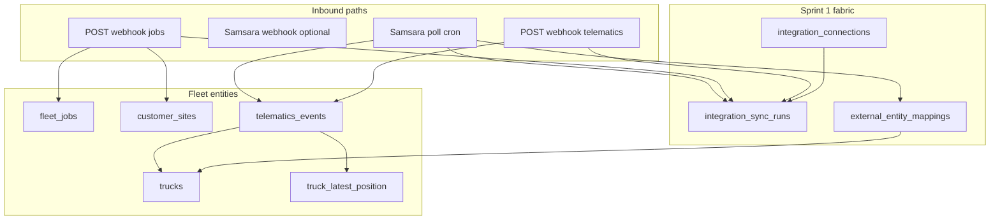

# Sprint 2 — Telematics Ingest + Job Webhook + Live Positions

**Status:** Planning / specification (no migrations or application code in this document)  
**Duration:** 2 weeks  
**Date:** June 2026

**Companion documents:**

- [fleet-intelligence-pivot-plan.md](fleet-intelligence-pivot-plan.md) — strategic context, telematics entity design (Section 7)
- [fleet-intelligence-implementation-roadmap.md](fleet-intelligence-implementation-roadmap.md) — Sprint 2 summary (Section 2)
- [sprint-1-fleet-foundation.md](sprint-1-fleet-foundation.md) — foundation schema, integration fabric, CSV import
- [fleet-sprint-1-rls-verification-checklist.md](fleet-sprint-1-rls-verification-checklist.md) — tenant isolation baseline

---

## Sprint goal

Make **real truck GPS and inbound jobs** flow into Cornerstone so a pilot customer can trust integration health before Sprint 3 dashboards:

1. **Samsara** OAuth connect, vehicle list sync, and GPS ingest (poll or webhook) with **≤5 min lag**
2. **Generic telematics webhook** for non-Samsara GPS events
3. **Generic job webhook** for `fleet_jobs` upsert (revenue + site + truck type required)
4. Append-only **`telematics_events`** with **`truck_latest_position`** for map reads
5. **Integration Control Plane** shows per-connection health, sync history, and failure alerts
6. **Trucks list** shows last telematics time and online/offline status

**Explicitly out of scope for Sprint 2:** `utilization_daily` mart, Fleet Command Center KPIs, dispatch truck lanes / map UI, recommendation engine, Geotab/Motive, QuickBooks, outbound webhooks, CMMS nav hiding.

### Architectural guardrails

| Rule | Rationale |
|------|-----------|
| Do **not** store live GPS on `trucks` beyond `last_telematics_at` | Position history lives in `telematics_events` only ([Sprint 1 spec](sprint-1-fleet-foundation.md)) |
| Do **not** join raw telematics in UI components | Sprint 3 reads marts; Sprint 2 may expose latest position API for trucks list only |
| **`telematics_events` is append-only** | No UPDATE/DELETE on events; retention policy is archival, not mutation |
| Inbound webhooks use **service role** + connection secret | Same pattern as Sprint 1 spec for webhook paths |
| Resolve external IDs via **`external_entity_mappings`** | Never trust client-supplied internal UUIDs on ingest |
| Do **not** extend [`src/lib/ops-optimization/engine.ts`](../src/lib/ops-optimization/engine.ts) | Fleet recommendations are Sprint 4 |

**Legend:** **Observed** = exists in codebase from Sprint 1. **Proposed** = Sprint 2 deliverable.

---

## Table of contents

1. [Sprint 1 reuse inventory](#1-sprint-1-reuse-inventory)
2. [Database schema](#2-database-schema)
3. [Integration ingest architecture](#3-integration-ingest-architecture)
4. [APIs](#4-apis)
5. [UI changes](#5-ui-changes)
6. [External integrations](#6-external-integrations)
7. [Permissions and RLS](#7-permissions-and-rls)
8. [Risks and mitigations](#8-risks-and-mitigations)
9. [Acceptance criteria](#9-acceptance-criteria)
10. [Testing plan](#10-testing-plan)
- [Appendix A — Job webhook JSON schema](#appendix-a--job-webhook-json-schema)
- [Appendix B — Telematics webhook JSON schema](#appendix-b--telematics-webhook-json-schema)
- [Appendix C — Samsara mapping notes](#appendix-c--samsara-mapping-notes)

---

## 1. Sprint 1 reuse inventory

### 1.1 Reusable schema (Observed)

Migration [`supabase/migrations/20260331100000_fleet_foundation.sql`](../supabase/migrations/20260331100000_fleet_foundation.sql):

| Object | Sprint 2 use |
|--------|----------------|
| `integration_connections` | Rows for `samsara`, `webhook_jobs`, `webhook_telematics`; columns `config`, `credentials_ref`, **`webhook_secret_hash`** (reserved for inbound auth) |
| `integration_sync_runs` | Every poll, webhook batch, vehicle sync, and backfill logs a run |
| `external_entity_mappings` | Samsara vehicle ID → `trucks.id`; webhook `external_id` → job/site/truck |
| `trucks.telematics_device_id` | Store Samsara asset/vehicle ID after mapping |
| `trucks.external_asset_id` | Optional secondary external key |
| `fleet_jobs.external_source_id` | Job webhook dedup / upsert key |
| `customer_sites.external_source_id` | Site upsert from job payload |
| `branches.code` | Resolve branch on job webhook when `branch_code` provided |

Provider enum already includes `samsara`, `webhook_jobs`, `webhook_telematics` in [`src/types/fleet.ts`](../src/types/fleet.ts).

### 1.2 Reusable libraries (Observed)

| Module | Reuse in Sprint 2 |
|--------|-------------------|
| [`src/lib/integrations/connections.ts`](../src/lib/integrations/connections.ts) | `listIntegrationConnections`, `upsertIntegrationConnection`, `updateConnectionSyncStatus`; extend for webhook secret generation |
| [`src/lib/integrations/sync-runs.ts`](../src/lib/integrations/sync-runs.ts) | `startSyncRun`, `finishSyncRun`, `listSyncRuns` — wrap all ingest paths |
| [`src/lib/integrations/mappings.ts`](../src/lib/integrations/mappings.ts) | `upsertExternalMapping`, `resolveExternalMapping` — Samsara + webhook ID resolution |
| [`src/lib/fleet/queries.ts`](../src/lib/fleet/queries.ts) | Extend with `listTrucksWithLatestPosition`, telematics freshness helpers |
| [`src/lib/geocoding.ts`](../src/lib/geocoding.ts) | Job webhook: geocode site address when lat/lng missing |
| [`src/lib/auth-context.ts`](../src/lib/auth-context.ts) | `getAuthContext`, `companyBelongsToTenant` for OAuth callback and admin routes |
| [`src/lib/permissions.ts`](../src/lib/permissions.ts) | `integrations.manage`, `fleet.view`, `fleet.manage` already defined |
| [`src/lib/supabase/admin.ts`](../src/lib/supabase/admin.ts) | Service-role client for webhook handlers and cron (bypass RLS with explicit `tenant_id`) |
| [`app/(authenticated)/onboarding-wizard/fleet-import-actions.ts`](../app/(authenticated)/onboarding-wizard/fleet-import-actions.ts) | CSV job import pattern: sync run + mappings + row validation — reference for webhook upsert logic |
| [`app/(authenticated)/fleet/actions.ts`](../app/(authenticated)/fleet/actions.ts) | Job/site validation rules (revenue, coords, branch scope) — extract shared validators for webhook |
| [`src/lib/notifications/service.ts`](../src/lib/notifications/service.ts) + [`policy.ts`](../src/lib/notifications/policy.ts) | Dispatch `integration.sync_failed` in-app notifications |
| [`app/(authenticated)/dispatch/dispatch-map-utils.ts`](../app/(authenticated)/dispatch/dispatch-map-utils.ts) | `haversineMiles`, coordinate helpers — Sprint 3 map; optional for stale-position sanity checks |

### 1.3 Reusable UI (Observed)

| Surface | Sprint 2 extension |
|---------|-------------------|
| [`app/(authenticated)/settings/integrations/page.tsx`](../app/(authenticated)/settings/integrations/page.tsx) | Samsara connect, webhook setup, health indicators |
| [`app/(authenticated)/settings/integrations/integrations-client.tsx`](../app/(authenticated)/settings/integrations/integrations-client.tsx) | Connection cards, sync run table, error banners |
| [`app/(authenticated)/fleet/trucks/page.tsx`](../app/(authenticated)/fleet/trucks/page.tsx) + [`trucks-list.tsx`](../app/(authenticated)/fleet/trucks/components/trucks-list.tsx) | Last telematics column, online/offline badge |
| [`app/(authenticated)/fleet/jobs/page.tsx`](../app/(authenticated)/fleet/jobs/page.tsx) | Show `external_source_id`, inbound source label |
| [`app/api/integrations/connections/route.ts`](../app/api/integrations/connections/route.ts) | Extend POST for Samsara/webhook connection setup |
| [`app/api/integrations/sync-runs/route.ts`](../app/api/integrations/sync-runs/route.ts) | Already lists history; no change required for read path |

### 1.4 Gaps Sprint 1 intentionally deferred

| Gap | Sprint 2 action |
|-----|-----------------|
| No `telematics_events` table | New migration |
| No inbound webhook routes | New `app/api/integrations/webhooks/*` |
| `webhook_secret_hash` column unused | Generate secret on webhook connection create; validate on POST |
| `IntegrationConnection` TS type omits `webhook_secret_hash` | Add field; never return raw secret on GET after creation |
| No cron / scheduled poll | New secured cron route |
| No `integration.sync_failed` notification event | Seed event type + policy category |
| CSV import scope uses raw membership (not `getAuthContext`) | Fix in RLS hardening pass or Sprint 2 if not done |

---

## 2. Database schema

**Migration target:** `supabase/migrations/20260415100000_fleet_telematics_ingest.sql` (additive only).

### 2.1 `telematics_events` (Proposed)

Append-only GPS and engine-state events. **Not** [`technician_locations`](../supabase/migrations/20260314050000_technician_portal_identity_tracking.sql).

| Column | Type | Null | Notes |
|--------|------|------|-------|
| `id` | uuid | PK | `gen_random_uuid()` |
| `tenant_id` | uuid | NOT NULL | Denormalized from truck |
| `truck_id` | uuid | NOT NULL | FK → `trucks(id)` ON DELETE CASCADE |
| `connection_id` | uuid | | FK → `integration_connections(id)` ON DELETE SET NULL — source connection |
| `recorded_at` | timestamptz | NOT NULL | Event timestamp from provider (not `now()`) |
| `latitude` | double precision | NOT NULL | CHECK ∈ [-90, 90] |
| `longitude` | double precision | NOT NULL | CHECK ∈ [-180, 180] |
| `speed_mph` | numeric(8,2) | | Nullable |
| `odometer_miles` | numeric(12,2) | | Nullable |
| `engine_on` | boolean | | Nullable |
| `idle` | boolean | | Nullable |
| `heading_deg` | numeric(6,2) | | Optional |
| `source` | text | NOT NULL | `samsara` \| `webhook_telematics` \| `csv_manual` \| `backfill` |
| `external_event_id` | text | | Provider dedup key; UNIQUE per connection when present |
| `raw_payload` | jsonb | NOT NULL DEFAULT `'{}'` | Full provider payload for audit |
| `ingested_at` | timestamptz | NOT NULL DEFAULT `now()` | Server receive time |

**Indexes:**

- `(truck_id, recorded_at DESC)` — primary read path for latest position
- `(tenant_id, recorded_at DESC)` — tenant-scoped admin queries
- `(connection_id, external_event_id)` UNIQUE WHERE `external_event_id IS NOT NULL` — idempotent ingest

**RLS:** `USING (current_user_has_tenant(tenant_id))` for SELECT only.  
**INSERT:** service role from ingest paths only; optional INSERT policy for authenticated service paths.  
**No UPDATE or DELETE policies** — append-only enforced at DB level (revoke UPDATE/DELETE from authenticated role or use trigger to reject).

**Retention (pilot):** 90 days raw events; archival to cold storage deferred post-pilot.

### 2.2 `trucks.last_telematics_at` (Proposed)

| Column | Type | Notes |
|--------|------|-------|
| `last_telematics_at` | timestamptz | Updated on each accepted event for that truck |

Enables fast “online/offline” queries without scanning `telematics_events`.

**Online heuristic (application):** `last_telematics_at >= now() - interval '10 minutes'` → online; configurable in connection `config`.

### 2.3 `truck_latest_position` (Proposed)

Materialized view or standard view — **prefer view for pilot simplicity**, materialized if perf requires:

```sql
-- Conceptual; implement in migration
SELECT DISTINCT ON (truck_id)
  truck_id, tenant_id, recorded_at, latitude, longitude,
  speed_mph, engine_on, idle, source
FROM telematics_events
ORDER BY truck_id, recorded_at DESC;
```

Expose via `src/lib/fleet/queries.ts` — UI reads this view, not ad-hoc joins in components.

### 2.4 `integration_connections` extensions (Proposed)

Use existing `config jsonb` for provider-specific settings:

| Provider | `config` keys (examples) |
|----------|--------------------------|
| `samsara` | `org_id`, `poll_interval_sec`, `oauth_scopes`, `last_vehicle_sync_at` |
| `webhook_jobs` | `allowed_branch_codes`, `default_company_id` |
| `webhook_telematics` | `truck_id_header`, `batch_max` |

**`webhook_secret_hash`:** Store bcrypt/argon2 hash of generated secret; show plaintext secret once on connection create in UI.

**`credentials_ref`:** Env/Vault pointer for Samsara refresh token (e.g. `SAMARA_TOKEN_{connection_id}` or Supabase vault secret name).

### 2.5 Optional: ingest dead-letter table (Defer unless time)

`integration_ingest_failures (connection_id, payload jsonb, error, created_at)` — defer to Sprint 2.1 if webhook volume is low; otherwise log failures in `integration_sync_runs.metadata`.

---

## 3. Integration ingest architecture



### 3.1 Shared ingest pipeline (Proposed)

New module: `src/lib/integrations/ingest/` (or `src/lib/integrations/connectors/shared/`):

1. **Resolve connection** — from OAuth state, URL path token, or `X-Connection-Id` + secret header
2. **Validate auth** — compare `X-Webhook-Secret` or `Authorization: Bearer` to `webhook_secret_hash`; Samsara uses OAuth token on outbound calls
3. **`startSyncRun(connection_id, tenant_id)`**
4. **Process batch** — map external IDs, validate business rules, insert rows
5. **`finishSyncRun`** — counts, `partial` if some rows failed
6. **`updateConnectionSyncStatus`** — `last_sync_at`, `status`, `last_error`
7. **On failure** — `status = 'error'`, emit `integration.sync_failed` notification

All writes set `tenant_id` from resolved connection — **never from request body**.

### 3.2 External entity mapping rules

| Entity | `entity_type` | When |
|--------|---------------|------|
| Samsara vehicle | `truck` | Vehicle list sync; match `unit_number` or manual link UI |
| Webhook job | `fleet_job` | After upsert by `external_id` |
| Webhook site | `customer_site` | After site create/upsert |
| Webhook truck ref | `truck` | If payload includes telematics external truck id |

Extend mapping resolution in [`mappings.ts`](../src/lib/integrations/mappings.ts) with `resolveInternalId(connectionId, entityType, externalId)`.

### 3.3 Job upsert logic (shared: webhook + future ETL)

Mirror validation from [`fleet-import-actions.ts`](../app/(authenticated)/onboarding-wizard/fleet-import-actions.ts) and [`saveFleetJob`](../app/(authenticated)/fleet/actions.ts):

1. Resolve branch by `branch_code` within tenant + company
2. Resolve or create site (geocode if needed); require lat/lng on site
3. **Reject** if `revenue_estimate` missing or `< 0`
4. **Reject** if `required_truck_type` missing
5. Upsert job by `(connection_id, external_id)` mapping or `fleet_jobs.external_source_id`
6. Optional: resolve `assigned_truck_id` by `unit_number` within branch

### 3.4 Telematics ingest logic

1. Resolve truck via `external_entity_mappings` or `trucks.telematics_device_id`
2. Reject if truck not in connection's tenant
3. Dedup by `(connection_id, external_event_id)` when provided
4. INSERT into `telematics_events`
5. UPDATE `trucks.last_telematics_at = recorded_at` (only if `recorded_at` is newer)

---

## 4. APIs

### 4.1 Module layout (Proposed)

```
src/lib/integrations/
  connections.ts          # extend: webhook secret, Samsara status
  sync-runs.ts            # unchanged
  mappings.ts             # extend: bulk resolve
  ingest/
    auth.ts               # webhook secret validation
    job-upsert.ts         # shared job ingest
    telematics-insert.ts  # shared GPS ingest
  connectors/
    samsara/
      oauth.ts            # authorize URL, token exchange
      client.ts           # REST wrapper
      sync-vehicles.ts    # vehicle list → trucks + mappings
      sync-positions.ts   # GPS poll → telematics_events
src/lib/fleet/
  queries.ts              # + latest position, online status
```

### 4.2 REST routes

| Method | Route | Auth | Purpose |
|--------|-------|------|---------|
| GET | `/api/integrations/samsara/authorize` | Session + `integrations.manage` | Redirect to Samsara OAuth |
| GET | `/api/integrations/samsara/oauth/callback` | Session + state param | Exchange code, store tokens, create/update `samsara` connection |
| POST | `/api/integrations/samsara/sync` | Session + `integrations.manage` | Manual trigger: vehicles + positions |
| POST | `/api/integrations/webhooks/jobs` | Connection secret header | Inbound job upsert (single or batch) |
| POST | `/api/integrations/webhooks/telematics` | Connection secret header | Inbound GPS events (single or batch) |
| POST | `/api/cron/integrations/samsara-poll` | `CRON_SECRET` header | Poll all active Samsara connections (1–5 min schedule) |
| GET | `/api/fleet/trucks/positions` | Session + `fleet.view` | Latest positions for tenant (reads `truck_latest_position`) |
| POST | `/api/integrations/connections` | Session (existing) | Extend: create webhook connection + return one-time secret |
| GET | `/api/integrations/connections` | Session (existing) | Extend: include health summary fields |
| GET | `/api/integrations/sync-runs` | Session (existing) | No change |

**Webhook URL shape (proposed):**

```
POST /api/integrations/webhooks/jobs?connection=<connection_uuid>
Header: X-Webhook-Secret: <secret>
```

Alternative: embed signed token in path — prefer header + connection id for log clarity.

**Cron:** Add `vercel.json` cron entry or Supabase `pg_cron` — document env `CRON_SECRET` in deployment notes.

### 4.3 Samsara connector (Proposed)

| Step | Action |
|------|--------|
| OAuth | Standard authorization code flow; store refresh token in vault/`credentials_ref` |
| Vehicle sync | `GET /fleet/vehicles` → upsert trucks by mapping or prompt for unit_number match |
| Position sync | `GET /fleet/vehicles/locations` or equivalent → batch insert events |
| Backfill | One-time admin action: pull 7–90 days historical GPS into `telematics_events` with `source = 'backfill'` |
| Mapping | Samsara vehicle id → `external_entity_mappings` (`entity_type = truck`) + `trucks.telematics_device_id` |

**Poll interval:** Default 300s (5 min); configurable per connection in `config.poll_interval_sec`.

### 4.4 Service-role rule

| Path | Client | Rule |
|------|--------|------|
| Webhook handlers | `createAdminClient()` | Resolve `connection_id` → `tenant_id`; set all row `tenant_id` explicitly |
| Samsara cron | `createAdminClient()` | Same; one sync run per connection per poll |
| User-initiated sync | User session + RLS | Admin trigger uses user client where RLS applies; token refresh may need service role |

---

## 5. UI changes

### 5.1 Integration Control Plane (extend Observed shell)

Route: [`/settings/integrations`](../app/(authenticated)/settings/integrations/page.tsx)

| Feature | Detail |
|---------|--------|
| **Samsara card** | “Connect Samsara” → OAuth; show connected org, last sync, vehicle count, error state |
| **Job webhook card** | “Enable job webhook” → create `webhook_jobs` connection; display URL + secret (once) + copy buttons |
| **Telematics webhook card** | Same for `webhook_telematics` |
| **Health summary** | Green / yellow / red per connection: `status`, `last_sync_at` age, last run `status` |
| **Sync history** | Existing table; add provider label, expand row for `metadata` failed payloads |
| **Webhook docs panel** | In-app JSON schema (Appendix A/B), auth header instructions, example `curl` |
| **Manual actions** | “Sync now” (Samsara), “Rotate webhook secret” (future — defer rotate if time-constrained) |

### 5.2 Trucks list (extend Observed)

[`/fleet/trucks`](../app/(authenticated)/fleet/trucks/page.tsx):

| Column / UI | Source |
|-------------|--------|
| Last GPS | `trucks.last_telematics_at` formatted relative time |
| Status badge | Online / Stale / Offline from heuristic |
| Last position | Optional tooltip with lat/lng from `truck_latest_position` |

**No map view in Sprint 2** — map pins are Sprint 3 dispatch board.

### 5.3 Fleet jobs list (minimal)

[`/fleet/jobs`](../app/(authenticated)/fleet/jobs/page.tsx):

| Column | Detail |
|--------|--------|
| Source | `CSV` / `Webhook` / `Manual` derived from mapping or `external_source_id` |
| External ID | Show `external_source_id` when present |

### 5.4 Truck ↔ Samsara mapping UI (Proposed, minimal)

If auto-match by `unit_number` fails, simple admin table:

- Unmapped Samsara vehicles (from last sync metadata)
- Dropdown to link to existing `trucks` row or create new truck

Defer full mapping UI if auto-match succeeds for pilot; document manual SQL fallback.

### 5.5 Notifications

Seed new event type **`integration.sync_failed`**:

- Category: `integrations` (new category or `settings`)
- Default: in-app ON for `admin`/`owner` with `integrations.manage`
- Trigger when `integration_sync_runs.status = 'failed'` or connection `status = 'error'`

Wire via [`src/lib/notifications/service.ts`](../src/lib/notifications/service.ts) at end of failed ingest.

---

## 6. External integrations

### 6.1 Priority matrix

| Priority | Integration | Sprint 2 deliverable |
|----------|-------------|---------------------|
| **P0** | Samsara OAuth + vehicle list + GPS poll | Full connector |
| **P0** | Generic job webhook | JSON upsert with validation |
| **P0** | Generic telematics webhook | GPS batch ingest |
| **P0** | CSV job import | Already in Sprint 1 — verify parity with webhook validation |
| **P1** | Samsara historical backfill | Admin-triggered 7–90 day pull |
| **P1** | Samsara inbound webhook | Only if poll lag insufficient |
| **Defer** | Geotab, Motive, QuickBooks, Fleetio | Post-pilot |

### 6.2 Fallback if Samsara OAuth delayed

1. Generic telematics webhook + CSV with lat/lng on trucks for demo
2. Manual “ping” POST to telematics webhook in QA
3. Integration Control Plane still shows connection health for webhook providers

---

## 7. Permissions and RLS

### 7.1 Permissions (Observed — extend usage)

| Permission | Sprint 2 use |
|------------|--------------|
| `integrations.manage` | Samsara connect, webhook setup, manual sync, view sync runs |
| `fleet.view` | Trucks list with telematics status; GET positions API |
| `fleet.manage` | Truck ↔ Samsara mapping UI |

### 7.2 RLS (Proposed)

| Table | Policy |
|-------|--------|
| `telematics_events` | SELECT: `current_user_has_tenant(tenant_id)`; INSERT: service role only (or restricted policy) |
| `truck_latest_position` | View inherits RLS via underlying table / security invoker |
| Existing fleet tables | Unchanged |

**Webhook isolation checklist:**

- [ ] Secret required on every webhook POST
- [ ] Invalid secret → 401, no sync run created
- [ ] Valid secret → connection resolves exactly one tenant
- [ ] Cross-tenant truck_id in payload → reject row, log in sync run metadata

See [fleet-sprint-1-rls-verification-checklist.md](fleet-sprint-1-rls-verification-checklist.md) — extend with telematics-specific cases in testing plan below.

---

## 8. Risks and mitigations

| Risk | Impact | Mitigation |
|------|--------|------------|
| Samsara OAuth / API approval delays | Pilot blocked on live GPS | Generic telematics webhook + manual CSV positions as fallback |
| Vehicle ID ↔ truck mapping mismatches | GPS dropped on ingest | Auto-match `unit_number`; minimal mapping UI; log unmapped in sync metadata |
| Webhook secret leakage | Cross-tenant spoofing | Show secret once; store hash only; rotate docs for pilot |
| High event volume / cost | DB growth, slow queries | Batch insert; index `(truck_id, recorded_at DESC)`; 90-day retention policy |
| Clock skew on `recorded_at` | Wrong “latest” position | Only update `last_telematics_at` when `recorded_at > existing` |
| Duplicate events | Inflated history | `external_event_id` unique per connection |
| Service role bypass | Wrong tenant write | Always derive `tenant_id` from `connection_id`; never from body |
| Poll cron failures silent | Stale map in Sprint 3 | `integration.sync_failed` notification + red connection status |
| Job webhook without geocodable address | Rejected jobs | Return 422 with field errors; partial batch → `partial` sync run |
| Sprint 1 CSV import scope bug | Wrong tenant import | Align with `getAuthContext` before Sprint 2 pilot |

---

## 9. Acceptance criteria

### Samsara

- [ ] OAuth connect completes for a Samsara sandbox org
- [ ] ≥15 trucks mapped to Samsara vehicles
- [ ] GPS events append to `telematics_events` with `source = 'samsara'`
- [ ] Measured ingest lag **≤5 minutes** under normal poll (document measurement method)
- [ ] `trucks.last_telematics_at` updates on each new event
- [ ] `truck_latest_position` returns one row per truck with correct coords

### Webhooks

- [ ] Job webhook creates new `fleet_jobs` with required revenue, site coords, truck type
- [ ] Job webhook updates existing job by `external_id` (idempotent)
- [ ] Telematics webhook inserts events for mapped trucks
- [ ] Invalid auth returns 401; invalid payload returns 422 with error detail
- [ ] Each webhook batch creates an `integration_sync_runs` row with accurate counts

### Integration health

- [ ] Integration Control Plane shows green/yellow/red per connection
- [ ] Failed sync sets connection `status = 'error'` and `last_error`
- [ ] `integration.sync_failed` notification delivered to admin user
- [ ] Sync history visible for Samsara, webhooks, and CSV (Sprint 1)

### Data integrity

- [ ] `telematics_events` has no UPDATE/DELETE paths in application code
- [ ] Tenant A webhook secret cannot ingest into tenant B
- [ ] Unmapped external truck ID logged as failed row, not attached to wrong truck

### Explicit non-goals (must remain true)

- [ ] No `utilization_daily` table or mart refresh
- [ ] No dispatch map truck pins / lanes UI
- [ ] No changes to `work_orders` / `technicians` table names or primary CMMS dispatch flow

---

## 10. Testing plan

### 10.1 Unit / integration tests (Proposed)

| Area | Test |
|------|------|
| Webhook auth | Valid secret passes; invalid/missing secret 401 |
| Job upsert | Missing revenue → reject; valid payload → job + mapping |
| Telematics dedup | Same `external_event_id` twice → one row |
| Latest position | Two events same truck → view shows newer `recorded_at` |
| Tenant isolation | Webhook connection A cannot insert event for truck in tenant B |

### 10.2 Manual — Samsara (browser)

1. Connect Samsara from Integration Control Plane
2. Run manual sync; verify trucks mapped and sync run `success`
3. Wait ≥5 min (or trigger cron); verify `last_telematics_at` updates on trucks list
4. Verify online badge turns stale after configured threshold with poll stopped

### 10.3 Manual — webhooks (`curl`)

```bash
# Job webhook — replace CONNECTION_ID, SECRET, base URL
curl -X POST "https://<host>/api/integrations/webhooks/jobs?connection=<CONNECTION_ID>" \
  -H "Content-Type: application/json" \
  -H "X-Webhook-Secret: <SECRET>" \
  -d '{
    "external_id": "job-1001",
    "branch_code": "NY01",
    "site_name": "Refinery Unit 4",
    "site_address": "123 Industrial Blvd, Houston, TX",
    "title": "Hydrovac — Unit 4",
    "scheduled_start": "2026-06-24T08:00:00Z",
    "scheduled_end": "2026-06-24T14:00:00Z",
    "revenue_estimate": 4500,
    "required_truck_type": "hydrovac"
  }'
```

```bash
# Telematics webhook
curl -X POST "https://<host>/api/integrations/webhooks/telematics?connection=<CONNECTION_ID>" \
  -H "Content-Type: application/json" \
  -H "X-Webhook-Secret: <SECRET>" \
  -d '{
    "events": [{
      "external_truck_id": "<SAMARA_VEHICLE_ID>",
      "external_event_id": "evt-001",
      "recorded_at": "2026-06-24T12:00:00Z",
      "latitude": 29.7604,
      "longitude": -95.3698,
      "speed_mph": 32,
      "engine_on": true,
      "idle": false
    }]
  }'
```

Verify in UI: job appears on `/fleet/jobs`; truck shows updated last GPS; sync run in Integrations.

### 10.4 Manual — Supabase SQL

```sql
-- Append-only check: UPDATE should fail or affect 0 rows
UPDATE telematics_events SET latitude = 0 WHERE id = '<some_id>';

-- Latest position sanity
SELECT t.unit_number, v.recorded_at, v.latitude, v.longitude
FROM truck_latest_position v
JOIN trucks t ON t.id = v.truck_id
WHERE t.tenant_id = '<tenant_id>'
ORDER BY t.unit_number;

-- Event volume per truck (last 24h)
SELECT truck_id, count(*) FROM telematics_events
WHERE tenant_id = '<tenant_id>' AND recorded_at > now() - interval '24 hours'
GROUP BY truck_id;
```

### 10.5 Regression

- [ ] Sprint 1 CSV import still logs sync runs
- [ ] Sprint 1 fleet CRUD unchanged
- [ ] [`fleet-sprint-1-rls-verification-checklist.md`](fleet-sprint-1-rls-verification-checklist.md) still passes for fleet entities

### 10.6 Pilot readiness gate (Sprint 2 exit)

- [ ] Demo script: connect Samsara **or** configure telematics webhook → see live positions on trucks list within 5 min
- [ ] Demo script: POST one job via webhook → job visible with revenue and site
- [ ] Integration Control Plane trustworthy for customer-facing pilot onboarding call

---

## Appendix A — Job webhook JSON schema

**Single job object** (batch: `{ "jobs": [ ... ] }`):

| Field | Required | Type | Notes |
|-------|----------|------|-------|
| `external_id` | Yes | string | Upsert key; maps to `fleet_jobs.external_source_id` |
| `branch_code` | Yes | string | Must match `branches.code` in tenant |
| `title` | Yes | string | |
| `revenue_estimate` | Yes | number | ≥ 0 |
| `required_truck_type` | Yes | string | e.g. `hydrovac` |
| `scheduled_start` | Yes | ISO8601 | |
| `scheduled_end` | Yes | ISO8601 | |
| `site_name` | Yes* | string | *Or `site_external_id` if site already mapped |
| `site_external_id` | Alt | string | Resolve via `external_entity_mappings` |
| `site_address` | Cond | string | Required if site coords unknown; triggers geocode |
| `site_latitude` / `site_longitude` | Cond | number | Required if no geocodable address |
| `priority` | No | string | Default `medium` |
| `status` | No | string | Default `unassigned` |
| `unit_number` | No | string | Assign truck if found in branch |
| `description` | No | string | |

**Response:** `{ "processed": N, "failed": M, "errors": [{ "external_id", "reason" }] }`

---

## Appendix B — Telematics webhook JSON schema

**Batch preferred:** `{ "events": [ ... ] }` (max 100 events per request — configurable)

| Field | Required | Type | Notes |
|-------|----------|------|-------|
| `external_truck_id` | Yes | string | Lookup via mapping or `telematics_device_id` |
| `recorded_at` | Yes | ISO8601 | Provider event time |
| `latitude` | Yes | number | |
| `longitude` | Yes | number | |
| `external_event_id` | No | string | Dedup |
| `speed_mph` | No | number | |
| `odometer_miles` | No | number | |
| `engine_on` | No | boolean | |
| `idle` | No | boolean | |
| `heading_deg` | No | number | |

---

## Appendix C — Samsara mapping notes

| Samsara field | Cornerstone field |
|---------------|-------------------|
| Vehicle `id` | `trucks.telematics_device_id` + mapping `external_id` |
| Vehicle `name` / `externalIds` | Match to `trucks.unit_number` |
| Location `latitude` / `longitude` | `telematics_events` |
| Location `time` | `telematics_events.recorded_at` |
| `engineState` / `idling` | `engine_on`, `idle` |

**Env vars (proposed):** `SAMARA_CLIENT_ID`, `SAMARA_CLIENT_SECRET`, `SAMARA_REDIRECT_URI`, `CRON_SECRET`.

---

## Related documentation

- [fleet-intelligence-implementation-roadmap.md](fleet-intelligence-implementation-roadmap.md) — Sprint 3 depends on Sprint 2 telematics + jobs
- [multi-tenant-architecture.md](multi-tenant-architecture.md)
- [notification-architecture.md](notification-architecture.md)
- [dispatch-command-center.md](dispatch-command-center.md) — Sprint 3 dispatch map reuse
